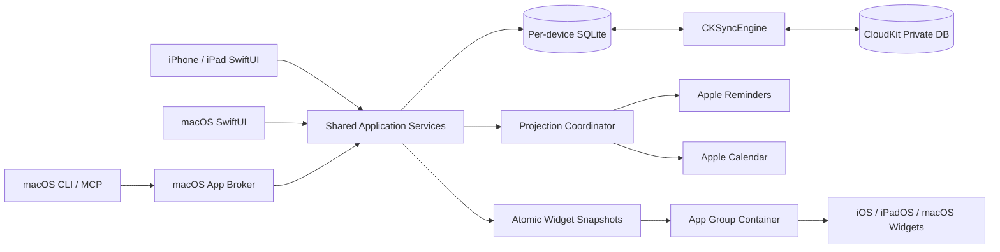

# CalendarCountdown iPhone / iPad 实现计划与架构设计

> 文档状态：待实施
>
> 编制日期：2026-09-10
>
> 交付对象：Grok 4.6 或后续实现者
>
> 当前工程：`/Users/hashxjhuang/CalendarCountdown`
>
> 当前分支：`grok/v2-p0-cloudkit-projection-broker`
>
> 当前基线：`02af78a` 加未提交的 CalendarCountdown 2.0 工作区
>
> 本文边界：设计、实施顺序、目录规划和验收合同。本文不代表 iPhone/iPad 版本已经实现，也不代表当前 CloudKit、EventKit 投影或 Widget 已通过真实设备验收。

---

## 0. 一页结论

Mac、iPhone、iPad 是**同一个 App**，不是独立产品。macOS 是主力平台和先发端；iPhone/iPad 共用同一套领域模型、SQLite schema、CloudKit container 和 App Group。移动端只换壳，不另开仓库、不另开 App Store 应用记录。

移动端是同一产品的一个 iOS App target，同时支持 iPhone 和 iPad：

- `TARGETED_DEVICE_FAMILY = "1,2"`，不建立两个独立 App，也不复制两套业务代码。
- 一级模块与当前 macOS 侧栏一致：**倒数日、任务清单、使命清单、打卡**。iPhone 底部四 tab 对应这四项；设置、同步状态和 Apple 日历权限走导航栏/sheet，倒数不再放进「更多」。
- iPad 使用 `NavigationSplitView`：左侧模块、中间列表、右侧详情，并适配横竖屏、分屏和 Stage Manager。
- `Core`、`Persistence`、`Services`、CloudKit 同步、EventKit 映射和大部分 SwiftUI Feature 共享。
- macOS 的 `NSApplicationDelegate`、菜单栏、窗口管理、本地 Broker 和 CLI 保留为 macOS 专属能力，不移植到 iPhone/iPad。
- 每台设备的 App 进程是本机 SQLite 的唯一写入主体；进程内只保留一个 `DatabasePool`。Widget 只读取 App Group 中的派生 JSON 快照，不打开 SQLite。
- 任务、使命、习惯、**倒数追踪意图与本工具管理的倒数规则**以每台设备的 SQLite 为离线副本，以 CloudKit private database 做记录级复制。
- 倒数/纪念日的**事件正文**仍以 Apple 日历为内容事实源。不得把 Apple 日历完整复制进 SQLite 或 CloudKit；同步的是规则、选择和置顶，不是 EventKit identifier。
- 本地模拟器是强制验收门槛，但不是唯一门槛。CloudKit production、后台调度、真实设备性能、真实日历/提醒事项行为仍必须在签名真机上单独验收。

推荐最低系统版本为 **iOS/iPadOS 18.0**。理由是与当前 macOS 15 最低版本对齐，完整覆盖当前使用的现代 SwiftUI 导航、EventKit 全访问模型、WidgetKit 和 CKSyncEngine，同时避免为旧系统保留长期双实现。若产品明确要求 iOS 17，再单独评估 API availability 和测试成本，不要在实现过程中临时降低部署目标。

---

## 1. 当前工程基线

### 1.1 已确认的本机环境

| 项目 | 当前值 |
|---|---|
| Xcode | 26.6（Build 17F113） |
| Swift | 6.3.3 |
| 已安装模拟器 Runtime | iOS 26.5 |
| iPhone 模拟器 | iPhone 17 Pro、17 Pro Max、17e、Air、17 |
| iPad 模拟器 | iPad Pro 13/11、iPad Air 13/11、iPad mini、iPad A16 |
| 当前工程生成方式 | XcodeGen：`Source/project.yml` |
| 当前依赖 | GRDB.swift 7.11.1 |

因此首轮本机运行验收以 iOS 26.5 为实际 Runtime；部署下限 iOS 18.0 通过编译设置、API availability 审查和可用时安装对应 Runtime 验证。不得把“在 iOS 26.5 模拟器运行成功”写成“iOS 18 真机已经通过”。

### 1.2 当前 targets

当前 `Source/project.yml` 只定义 macOS targets：

- `CalendarCountdownCore`
- `CalendarCountdownPersistence`
- `CalendarCountdownCalendar`
- `CalendarCountdown`
- `CalendarCountdownWidget`
- `calcount`
- `CalendarCountdownCoreTests`
- `CalendarCountdownPersistenceTests`

移动端目标尚不存在。实现时必须修改 `project.yml` 并重新生成工程；`CalendarCountdown.xcodeproj/project.pbxproj` 是生成产物，不应成为唯一事实源。

### 1.3 可复用代码

以下目录原则上应跨平台复用：

- `Source/Core/Domain/`：Task、Mission、Habit、Recurrence、时间与领域链接。
- `Source/Core/Contracts/`：Repository、Command、错误、Cloud 记录和合并合同。
- `Source/Persistence/`：GRDB schema、migration、repositories、CloudKit 同步状态和 projection binding。
- `Source/Services/`：Task、Mission、Habit、Workspace 应用服务。
- `Source/Core/LunarDateResolver.swift` 与日期计算。
- `Source/Core/WidgetSnapshot.swift` 的数据模型和编解码逻辑。
- `Source/CalendarBridge/` 中不依赖 AppKit 的 EventKit/Reminder/Calendar 映射逻辑。

### 1.4 现有平台耦合

移动端开始前必须显式处理这些耦合，而不是用大量散落的 `#if os(iOS)` 掩盖：

1. `CalendarCountdownApp.swift` 完全基于 AppKit：`NSApplicationDelegate`、`NSWindowController`、`NSStatusItem`、`NSPopover` 和 `NSWorkspace`。
2. `AppearanceSettings.swift` 使用 `NSAppearance`、`NSColor` 和 `Color(nsColor:)`。
3. `EventKitRepository.swift` 仅因颜色转换而 `import AppKit`、接收 `NSColor`。
4. 多个 SwiftUI View 使用 macOS 专用或桌面语义：checkbox toggle、固定窗口尺寸、菜单栏操作、“退出”按钮、外观设置独立窗口。
5. `SharedContainer.rootURL` 对非沙盒 macOS 使用手工拼接 `~/Library/Group Containers/...`；iOS 只能通过正式 App Group entitlement 与 `containerURL(...)` 获取容器。
6. 当前 Widget entitlement 没有 App Group，V2 Task/Mission/Habit Widget 已知无法稳定读到 App 写入的快照。
7. 当前 2.0 分支仍有 CloudKit 账号 profile 隔离、deferred inbox、HabitPeriod outbox、Habit/Mission 投影、projection retry 等未闭环项。移动端不能把这些缺口复制成第二份实现。

### 1.5 迁移前的硬性保护

当前工作区存在大量未提交改动和未跟踪文件。Grok 开始实施前必须：

1. 记录 `git status --short --branch`、`git diff --stat` 和当前测试结果。
2. 将现有 2.0 工作保存为可追溯 commit；如果尚不适合提交，至少创建独立 worktree/备份分支，禁止覆盖或清理。
3. 新建 `grok/ios-ipados` 或 `codex/ios-ipados` 开发分支。
4. 不删除现有 macOS 入口、CLI、Broker、DMG 脚本或 1.x 倒数数据。
5. 每次移动目录前先让测试保持全绿；目录移动与业务改动分开提交。

---

## 2. 产品范围

### 2.1 移动端首个可验收版本必须包含

#### 任务清单中的今日摘要

“今天”不是一级入口，也不是第五个 tab。任务清单内部提供今日筛选/摘要：

- 今天到期、逾期和计划开始的任务。
- 同一任务模块内可切换全部任务与收集箱。
- 今日习惯进度、使命摘要和最近倒数仍分别属于打卡、使命清单和倒数日。
- 下拉刷新；刷新后 SQLite、EventKit、CloudKit 和 Widget 快照的状态口径可区分。

#### 任务

- 创建、查看、编辑、完成、重开、跳过、归档和软删除。
- 单次任务、固定计划循环和按完成后循环。
- 开始时间、截止时间、优先级、工作量、使命关联、Markdown 描述。
- 对循环任务明确“仅此实例 / 此后实例 / 整个系列”的编辑范围。
- 可选择投影到 Apple Reminders；时间块可选择投影到 Apple Calendar。

#### 使命

- 创建、查看、编辑、暂停、完成、归档。
- 目标日期、颜色、图标、Markdown 描述。
- 展示计划总量、完成量、百分比和持续性指标的解释。
- 添加/移除关联任务时进度即时重算。

#### 习惯

- binary、count、quantity 三种度量。
- 每日、指定星期、每周/月 N 次等已被领域合同支持的计划。
- 打卡、补打、撤销、跳过/休息、连续达标和历史记录。
- 可选提醒事项投影；原生完成回写必须转换为正确的 Habit CheckIn，而不是 Task completion。

#### 倒数与日历

- 请求 Apple Calendar 完全访问并正确处理 notDetermined、denied、restricted、writeOnly 和 fullAccess。
- 按 Apple 原生账户/日历展示事件和颜色。
- 追踪/取消追踪、置顶、隐藏某日历、导入、导出。
- 公历年度事件、农历年度规则、闰月和月末回退规则保持与 macOS 一致。
- 写入前明确目标日历；只修改本工具有稳定标识的托管事件。

#### Widget 与深链

- 倒数、今日任务、使命进度、今日习惯四类移动端 Widget。
- iPhone：`.systemSmall`、`.systemMedium`、`.systemLarge`；锁屏 accessory 作为第二阶段。
- iPad：在上述基础上支持 `.systemExtraLarge`，布局必须独立适配。
- Widget 点击进入对应模块或对象详情。
- 第一版可先使用深链完成/打卡；交互式 Widget 的 `AppIntent` 在数据锁与一致性模型通过后再开启。

### 2.2 非目标

- 不在移动端运行 `calcount` CLI、Unix socket Broker 或 MCP stdio server。
- 不建立 iPhone 与 iPad 两套业务模型、两套 SQLite schema 或两套 CloudKit schema。
- 不把 SQLite 文件放入 iCloud Drive 多设备共同打开。
- 不把 Apple Calendar/Reminders 当成 Task/Mission/Habit 的恢复数据库。
- 不直接从 Widget 打开或写入 SQLite。
- 不在首版加入 watchOS、visionOS、Live Activity、Control Center Control 或 Shortcuts 全套能力。
- 不因移动端开发顺手重写 macOS UI；共享抽取后必须保持 macOS 回归通过。
- 不以模拟器通过代替 production CloudKit、真机后台和 App Store 发布验收。

---

## 3. 架构决策

### 3.1 事实源与数据流



必须在文档和代码中保持以下口径：

- SQLite transaction success：本机核心数据已提交。
- CloudKit outbox queued：等待上传，不等于已上传。
- CloudKit send/fetch success：某次同步完成，不等于另一设备已展示。
- Projection success：本机 Apple Calendar/Reminders 投影已写入。
- Widget snapshot success：快照已生成，不等于 Widget 已重新渲染。
- Simulator E2E success：开发环境通过，不等于 production/真机通过。

### 3.2 单一移动 App target

推荐 target：

```text
CalendarCountdownMobile
  platform: iOS
  device families: iPhone + iPad
  deployment target: 18.0
```

iPhone 与 iPad 共用同一 App 生命周期、业务服务和 Feature views，通过 size class、`NavigationSplitView` 折叠行为、平台能力和布局策略适配。这是同一 App Store 产品的 iOS target，不是独立应用。不要使用 `UIDevice.current.userInterfaceIdiom` 在每个页面分叉整棵 View；仅在确实存在设备能力差异时判断 idiom。

### 3.3 移动端没有 Broker

macOS Broker 用来统一 CLI/MCP 与 App 的 SQLite/EventKit 权限主体；iOS 不允许这种桌面式本地工具链。移动端采用：

- App 前台写入：直接调用共享 Application Services。
- AppIntent/Widget 写入：调用专门的 `IntentCommandHandler`，进入同一事务、幂等和审计路径。
- Widget 展示：只读快照。
- CloudKit 回写：由 App 的同步协调器进入同一 Repository/merge 路径。

共享的不是 IPC 方式，而是 Command、Validation、Repository 和 Result contracts。

### 3.4 平台能力注入

建立小而明确的平台协议，避免共享 View 直接 import AppKit/UIKit：

```swift
protocol PlatformCapabilities {
    var supportsMenuBar: Bool { get }
    var supportsLocalBroker: Bool { get }
    var supportsExtraLargeWidget: Bool { get }
    func openSystemSettings(for destination: SettingsDestination)
}

protocol SharedContainerLocating {
    func appGroupRoot() throws -> URL
    func cacheRoot() throws -> URL
}
```

只对生命周期、窗口、系统设置跳转、颜色桥接、菜单栏和本地 Broker 做平台实现。业务逻辑、路由枚举、表单校验、服务调用和状态展示保持共享。

### 3.5 EventKit 标识不是跨设备主键

`EKEvent.eventIdentifier`、calendar identifier 和 reminder identifier 只能当当前设备的 projection binding。不同设备或账户重建后都可能需要重新关联。

跨设备规则：

- Task/Mission/Habit 以及倒数追踪意图使用领域 UUID。
- 本工具创建的 Event/Reminder 使用 `calendarcountdown://.../<UUID>` 稳定 URL 重连。
- projection destination（具体 calendar/list identifier）只保存在本机 profile，不上传 CloudKit。
- 用户同步的是“希望投影任务/习惯”等策略，不同步某台设备上的 EventKit identifier。
- 找不到本机目标日历/列表时进入 `needsDestinationSelection`，不得静默写入默认日历。

### 3.6 倒数选择的跨设备语义

倒数事件正文仍来自 Apple Calendar。同步的是本工具管理的规则、追踪意图和置顶，全部进入 CloudKit：

| 选择模式 | CloudKit 同步内容 | 新设备行为 |
|---|---|---|
| `managedRecord` | 领域 UUID、历法规则、标题、稳定 URL、置顶 | 用 `calendarcountdown://event/<UUID>` 在本机日历重连；找不到则显示待修复，不自动重复创建 |
| `annualTitle` | 标题、日历名称、匹配规则、置顶 | 在本机日历按标题重新解析；多重匹配要求用户确认 |
| `exactEvent` | 标题、日历名称、externalIdentifier、occurrenceDate、置顶 | 优先用 external identifier；否则按标题+日期重连。EventKit `eventIdentifier` / `calendarIdentifier` 只保存在本机 |

`untrackedCalendarIdentifiers`（按本机日历 ID 隐藏类别）仍仅本机保存，不上传 CloudKit。

这不是建立第二套日历数据库。

### 3.7 CloudKit 生命周期

沿用 `CKSyncEngine`，但先修复当前 2.0 已知缺口：

- iCloud 账号切换必须切换到独立本地 profile，禁止 A/B 账号共用 SQLite/outbox。
- fetched records 不能 `try?` 后静默丢弃；建立 deferred inbox 和可见错误状态。
- HabitPeriod 的 skip/check-in/undo 必须进入正确 outbox。
- Cloud apply 成功后发布领域变更，刷新 UI、Widget snapshot，并排队 projection reconcile。
- 同步状态序列化、outbox 和 device ID 必须绑定当前 profile。
- Development schema 与 Production schema 分开验收。

iOS App 在启动、scene 进入 active、用户下拉刷新、网络恢复后的系统机会中驱动同步。不要承诺固定分钟级后台刷新；后台执行由系统调度。可测试的合同应是“前台必触发、手动可触发、后台有机会触发、下次启动必补偿”。

---

## 4. 推荐 targets 与依赖方向

### 4.1 最终目标图

```text
CalendarCountdownCore
    ↑
CalendarCountdownPersistence ← GRDB / CloudKit / CryptoKit
    ↑
CalendarCountdownServices
    ↑                    ↑
CalendarCountdownAppleBridge  CalendarCountdownSharedUI
    ↑                    ↑
CalendarCountdown (macOS)     CalendarCountdown (iOS + iPadOS)
    ↑                    ↑
CalendarCountdownWidgetMac    CalendarCountdownWidget iOS
```

CLI/Broker 只存在于 macOS 路径：

```text
calcount / MCP → BrokerClient → CalendarCountdown macOS AppBroker → Services
```

### 4.2 是否重命名现有 targets

第一阶段不要求大规模重命名，优先降低 diff：

- 保留 `CalendarCountdownCore`。
- 保留 `CalendarCountdownPersistence`。
- 暂时保留 `CalendarCountdownCalendar`，先去除 AppKit 依赖；后续独立提交重命名为 `CalendarCountdownAppleBridge`。
- 保留现有 macOS `CalendarCountdown` 和 `CalendarCountdownWidget` target 名。
- 新增 `CalendarCountdownMobile`、`CalendarCountdownMobileWidget`、`CalendarCountdownMobileTests`、`CalendarCountdownMobileUITests`。
- 共享 UI 可以先以同一 sources folder 加入两个 App targets；稳定后再提取 `CalendarCountdownSharedUI` 静态库。

### 4.3 依赖规则

- Core 不依赖 SwiftUI、EventKit、CloudKit、GRDB、AppKit 或 UIKit。
- Persistence 不依赖 UI 或 EventKit。
- Services 依赖 Core/Persistence，不依赖 AppKit/UIKit。
- AppleBridge 依赖 EventKit/Core，不能依赖 App UI。
- SharedUI 依赖 Core/Services/AppleBridge contracts，不直接执行 SQL。
- Platform shells 负责 lifecycle、scene、窗口、菜单栏、系统设置跳转和依赖装配。
- Widget 依赖 Core 中的 snapshot contracts；不得依赖 Persistence/GRDB。
- 测试 support 不进入 Release target。

---

## 5. 推荐目录结构

目标结构如下。为了保护当前未提交工作，必须分阶段移动，不能一次性“大扫除”。

```text
CalendarCountdown/
  README.md
  Documentation/
    PRODUCT.md
    IPHONE_IPAD_IMPLEMENTATION_PLAN.md
    Architecture/
      DATA_OWNERSHIP.md
      CLOUDKIT_SYNC.md
      EVENTKIT_PROJECTION.md
      MOBILE_NAVIGATION.md
    Acceptance/
      Mobile/
        README.md
        TestCases.md
        EvidenceTemplate.md
  Source/
    project.yml

    Core/                         # 纯 Swift 领域与合同，跨平台
      Domain/
      Contracts/
      DateSupport.swift
      LunarDateResolver.swift
      Models.swift
      ProductConstants.swift
      WidgetSnapshot.swift

    Persistence/                  # GRDB、本地 profile、CloudKit
      Database/
        AppDatabase.swift
        DatabaseMigrations.swift
        Records.swift
        DomainStore.swift
      Cloud/
        CloudKitSyncEngine.swift
        CloudSync.swift
        CloudProfileCoordinator.swift
        DeferredCloudInbox.swift
      Projection/
        ProjectionCoordinator.swift
      ApplicationRouter.swift

    Services/                     # 统一应用服务
      Workspace.swift
      TaskService.swift
      MissionService.swift
      HabitService.swift
      CountdownService.swift
      WidgetSnapshotService.swift

    AppleBridge/                  # 当前 CalendarBridge 的演进目标
      EventStoreAccess.swift
      EventKitRepository.swift
      ReminderRepository.swift
      CalendarProjectionRepository.swift
      EventKitMapping.swift
      EventKitChangeMonitor.swift

    SharedUI/                     # macOS/iOS/iPadOS 共用的 Feature UI
      AppState/
        AppSession.swift
        WorkspaceModel.swift
        CountdownModel.swift
        SyncStatusModel.swift
      Navigation/
        AppRoute.swift
        DeepLinkRouter.swift
      Components/
        StatusBanner.swift
        PermissionCard.swift
        EmptyStateView.swift
        MarkdownView.swift
      Features/
        Today/
        Tasks/
        Missions/
        Habits/
        Countdown/
        Calendar/
        Settings/
      Styling/
        Theme.swift
        ColorConversion.swift

    Platforms/
      macOS/
        App/
          CalendarCountdownApp.swift
          AppDelegate.swift
          MacRootView.swift
          WindowCoordinator.swift
        MenuBar/
          MenuBarContentView.swift
        Settings/
          MacAppearanceSettingsView.swift
        Automation/
          AppBroker.swift

      iOS/
        App/
          CalendarCountdownMobileApp.swift
          MobileAppDelegate.swift
          MobileRootView.swift
          MobileSceneCoordinator.swift
        Navigation/
          PhoneTabRoot.swift
          PadSplitRoot.swift
        Settings/
          MobileSettingsView.swift
        Support/
          MobilePlatformCapabilities.swift
          MobileContainerLocator.swift
          MobileTestSeed.swift           # DEBUG / UI test only

    Widgets/
      Shared/
        SnapshotTimelineProvider.swift
        CountdownWidgetView.swift
        TasksWidgetView.swift
        MissionsWidgetView.swift
        HabitsWidgetView.swift
        WidgetDeepLinks.swift
      macOS/
        CalendarCountdownWidgetBundleMac.swift
      iOS/
        CalendarCountdownWidgetBundleMobile.swift
        MobileWidgetFamilies.swift
        MobileWidgetIntents.swift

    CLI/                          # macOS only
    MCP/                          # macOS only，如当前实现保留在 CLI 中也可

    Config/
      Shared/
        Base.xcconfig
        Debug.xcconfig
        Release.xcconfig
      macOS/
        App-Info.plist
        App.entitlements
        Widget-Info.plist
        Widget.entitlements
      iOS/
        Mobile-Info.plist
        Mobile.entitlements
        MobileWidget-Info.plist
        MobileWidget.entitlements

    Resources/
      Shared/
        Assets.xcassets
        Localization/
      macOS/
      iOS/

    Tests/
      CoreTests/
      PersistenceTests/
      ServicesTests/
      AppleBridgeTests/
      MobileTests/
      Fixtures/

    UITests/
      Mobile/
        PhoneNavigationUITests.swift
        PadNavigationUITests.swift
        PermissionsUITests.swift
        WidgetDeepLinkUITests.swift

    Scripts/
      bootstrap.sh
      build.sh
      test-mobile.sh
      test-simulator-matrix.sh
      collect-mobile-evidence.sh
      package-dmg.sh               # macOS 保留
```

### 5.1 从当前目录迁移的顺序

1. 先新增 iOS Config 和 mobile entrypoint，不移动任何现有文件。
2. 去除 `CalendarBridge/EventKitRepository.swift` 对 AppKit 的颜色依赖。
3. 把 `WorkspaceModel`、`AppModel` 和可共享 Feature View 拆到 `SharedUI`。
4. 把 `CalendarCountdownApp.swift` 中 AppKit lifecycle 留在 `Platforms/macOS`。
5. 把外观设置拆成共享 theme model + Mac/iOS 颜色桥接。
6. Widget 先拆共享 View/Provider，再建立两个 Bundle entrypoint。
7. 所有 targets 和测试稳定后，才把 `CalendarBridge` 更名为 `AppleBridge`、拆 Persistence 子目录。

每一步都应是独立 commit，并同时通过 macOS 与移动端编译。纯目录移动 commit 不混入业务逻辑修改。

---

## 6. XcodeGen 与签名配置

### 6.1 新增移动 App target

目标配置要点：

```yaml
CalendarCountdownMobile:
  type: application
  platform: iOS
  deploymentTarget: "18.0"
  # TARGETED_DEVICE_FAMILY: "1,2"
  # SUPPORTS_MACCATALYST: NO（当前已有原生 macOS App）
```

不要直接照抄以上片段覆盖 `project.yml`；实现者应根据当前 XcodeGen schema 合并完整 sources、resources、dependencies、Info 和 entitlements。

推荐 identifiers：

| 组件 | Identifier |
|---|---|
| App Store 产品 | 同一应用记录（universal purchase），Mac 为主力平台 |
| macOS App | `app.calendarcountdown.CalendarCountdown`（保留） |
| iOS/iPadOS App | 优先与 macOS 同一产品；若双 native target 签名要求不同 bundle ID，使用 `app.calendarcountdown.CalendarCountdown.ios` 并挂到同一 App Store Connect 记录 |
| macOS Widget | `app.calendarcountdown.CalendarCountdown.Widget`（保留） |
| iOS/iPadOS Widget | `app.calendarcountdown.CalendarCountdown.ios.Widget`（仅当 iOS App bundle ID 必须分叉时） |
| CloudKit container | `iCloud.app.calendarcountdown.CalendarCountdown`（三端共用） |
| App Group | `group.app.calendarcountdown.CalendarCountdown`（三端同设备 App/Widget 共用） |

不要为移动端创建第二个 App Store 应用、第二个 CloudKit container 或第二套 schema。Mac Catalyst 关闭（已有原生 macOS App）。

### 6.2 必需 capabilities

Mobile App：

- iCloud → CloudKit，绑定现有 container。
- App Groups，绑定正式 group。
- Calendar access（由 Info usage description + EventKit runtime request 控制）。
- Reminders access。
- Background Modes 中只启用真实需要且签名支持的模式；不要机械复制 macOS 当前的 `UIBackgroundModes`。

Mobile Widget：

- App Groups，与 Mobile App 完全一致。
- 如使用 AppIntent 修改数据，必须设计可重入、幂等和跨进程锁；首版建议深链回 App。

Info.plist 至少包含：

- `NSCalendarsFullAccessUsageDescription`
- `NSRemindersFullAccessUsageDescription`
- `CFBundleURLTypes` / `calendarcountdown` scheme
- 正确版本号和 display name
- 若注册 background task，再加入对应 permitted identifiers

### 6.3 Debug 与 Release 配置

- Debug 使用 CloudKit Development environment 和虚构测试数据。
- Release/Archive 使用真实签名，并在 production schema 部署后测试 CloudKit Production。
- 不把测试 Apple ID、container token、用户日历内容或 simulator 数据提交仓库。
- `CODE_SIGNING_ALLOWED=NO` 只用于纯编译/单元测试；它不能证明 App Group、CloudKit、EventKit entitlement 或真机安装成立。

---

## 7. 存储与迁移设计

### 7.1 App Group 容器

移动端必须通过：

```swift
FileManager.default.containerURL(
    forSecurityApplicationGroupIdentifier: ProductConstants.appGroupIdentifier
)
```

访问共享容器。获取失败应产生明确、可诊断错误，Release 不得回退到一个 Widget 看不到的 Application Support 目录。

推荐同设备容器内容：

```text
<App Group>/CalendarCountdown/
  Profiles/<account-hash>/calendarcountdown-v2.sqlite
  Profiles/<account-hash>/calendarcountdown-v2.sqlite-wal
  Profiles/<account-hash>/calendarcountdown-v2.sqlite-shm
  Profiles/<account-hash>/Backups/
  widget-snapshot.json
  widget-snapshot-v2.json
  tracked-events.json
  LocalProjection/
```

注意：App Group 只解决同一设备 App 与 extension 的共享，不负责跨设备同步。跨设备复制走 CloudKit 记录，不复制 `.sqlite` 文件。

SQLite 与 sidecar 必须排除 iCloud/iTunes 备份；详见 7.2。JSON 快照仍可备份，因为 Widget 只读它们。

### 7.2 SQLite 单写者与文件合同

`AppDatabase.open` 经 `AppDatabasePoolRegistry` 按标准化路径 intern：同一进程、同一数据库路径只保留一个 `DatabasePool`。`close()` 先从 registry 移除再关闭连接。测试用 `openTemporary()` 与正式容器路径互不共用。

文件合同由 `SQLiteFilePolicy` 在打开、migration 备份和 `prepareDatabase` 时落实：

| 项 | 合同 |
|---|---|
| 备份排除 | 库文件、`-wal`、`-shm`、父目录和 `Backups/` 均设 `isExcludedFromBackup = true` |
| iOS 文件保护 | `FileProtectionType.completeUntilFirstUserAuthentication`（macOS 无此 API，不设置） |
| 写入主体 | 每台设备的 App 进程是本机 SQLite 的唯一写入主体 |
| Widget | 只读 App Group 派生 JSON 快照，不打开 SQLite |
| AppIntent | 首版优先 `openAppWhenRun` 或深链；若以后必须在 extension 写库，需另设计跨进程互斥、busy timeout、审计和 Widget timeline reload |
| migration | 变更前用 SQLite backup API 生成一致性备份；失败时保留原库并展示恢复入口，禁止自动重建空库伪装成功 |

### 7.3 倒数数据：SQLite + CloudKit，JSON 为镜像

倒数追踪意图与本工具管理的规则以 SQLite 为离线副本，经 CloudKit 记录级复制：

- `CDManagedEvent`：本工具创建的倒数/生日规则。payload 剥离本机 `calendarIdentifier`。
- `CDCountdownSelection`：追踪意图。不上传 EventKit `eventIdentifier` / `calendarIdentifier`。
- `CDCountdownPreferences`：置顶。`untrackedCalendarIdentifiers` 仅本机 `countdown_hidden_calendars`，不进 CloudKit。

`managed-events.json`、`countdown-selections.json`、`display-preferences.json` 和 `tracked-events.json` 是 1.x 遗留与 Widget/导出镜像。App 进程打开共享容器时可由 `CountdownService.importLegacyJSONIfNeeded` 导入一次；之后以 SQLite 为准，需要时再镜像回 JSON。测试库默认不写真实 App Group JSON。

新设备通过 CloudKit 拿到规则、选择和置顶后，在本机 Apple Calendar 重连：

1. 读取该设备 Apple Calendar，按稳定 URL、标题或日期解析。
2. 用户仍可导入 `tracked-events.json`，先预览再确认。
3. 不可解析的 `exactEvent` 保持“待重连”，不偷偷复制或重复创建 Apple Calendar 事件。

### 7.4 本地 profile 与 iCloud 账号

`localOnly`、iCloud A、iCloud B 必须是可区分的 profile：

- 未登录/关闭同步时写入 Local profile。
- 开启 iCloud 时提示是“把本机数据合入当前账号”还是“切换到云端 profile”。
- 换号先停止旧 CKSyncEngine，冻结旧 outbox，然后打开新 profile。
- 旧账号重新登录时恢复对应 profile。
- projection binding 是本机局部数据，但仍需归属正确 profile。

---

## 8. UI 与交互架构

### 8.1 共享路由

建立值类型路由，不让 UI 状态依赖某个具体 split/tab 实现：

```text
AppSection: countdown / tasks / missions / habits
AppRoute:
  task(UUID)
  mission(UUID)
  habit(UUID)
  countdown(UUID)
  calendar(String)
  syncStatus
  permissionSettings
```

一级模块必须与当前 macOS `RootView` 侧栏一致，不得另做一套信息架构。设置、日历权限和同步状态是二级路由，不是第五个一级 tab。

所有 `calendarcountdown://` 深链先解析为 `AppRoute`，再由 iPhone/iPad/macOS shell 决定如何呈现。

### 8.2 iPhone 导航

底部四个 tab，顺序与 macOS 左侧栏一致：

1. 倒数日
2. 任务清单
3. 使命清单
4. 打卡

设置、同步状态和 Apple 日历权限走导航栏或 sheet。不设「更多」一级入口，也不把倒数埋进去。

每个 tab 使用独立 `NavigationStack` 和 route path，切 tab 不丢失栈。创建按钮位于 toolbar；表单使用 sheet，复杂详情在 stack 中 push。键盘弹出时主要保存按钮不可被遮挡。

### 8.3 iPad 导航

使用三列 `NavigationSplitView`，与 macOS 同一套一级模块：

- Sidebar：倒数日、任务清单、使命清单、打卡；设置作为列表底部次要项。
- Content：当前模块列表、筛选和搜索。
- Detail：对象详情/编辑/空状态。

在窄宽度、Slide Over 或小分屏时自然折叠为 stack，并显式管理 `preferredCompactColumn`，确保深链不会落在空 detail。支持键盘快捷键是加分项，不是首个验收阻断。

### 8.4 表单与编辑语义

- 新建和编辑共用 draft + validator，不直接绑定数据库 record。
- 保存时使用 command + `ifRevision`，冲突时显示可理解的比较，不静默覆盖。
- destructive 操作二次确认，明确影响“实例/未来/系列”。
- EventKit 写入必须显示目标 Calendar/Reminder List。
- 权限被拒绝时展示 Settings 跳转；任务核心创建不能因 EventKit 权限失败而丢失，投影进入可重试状态。

### 8.5 适配和可访问性

每个核心页面必须覆盖：

- iPhone 小屏与大屏、竖屏和横屏。
- iPad mini 与 13 英寸 iPad、横竖屏、1/3 与 1/2 分屏。
- 浅色、深色和高对比度。
- Dynamic Type 默认、XXXL 和 Accessibility sizes。
- VoiceOver label/hint、按钮最小触控面积、键盘焦点与 Reduce Motion。
- 简体中文和英文为强制验收语言；已有日/韩/西/俄本地化不得因 key 缺失崩溃或显示 raw key。

---

## 9. Widget 设计

### 9.1 快照合同

主 App 在以下时机原子重建快照：

- 本地 command 成功后。
- CloudKit apply 成功后。
- EventKit reconcile 成功或状态变化后。
- App 进入 background 前。
- 用户手动刷新后。

快照包含 `schemaVersion`、`generatedAt`、profile identity hash、数据项和状态摘要。Widget 发现 schema 不兼容、profile 不匹配或快照损坏时显示可行动的占位，不崩溃、不读 SQLite。

### 9.2 家族矩阵

| Widget | iPhone | iPad | 首版交互 |
|---|---|---|---|
| 倒数 | small/medium/large | small/medium/large/extraLarge | 深链到倒数详情 |
| 今日任务 | small/medium | small/medium/large/extraLarge | 深链到任务；直接完成后置 |
| 使命进度 | small/medium | small/medium/large/extraLarge | 深链到使命 |
| 今日习惯 | small/medium | small/medium/large/extraLarge | 深链到习惯；直接打卡后置 |

使用 `widgetFamily` 构造真正不同的信息密度，不用统一视图简单缩放。iPad extra large 要利用空间显示分组和进度，不可只把字体放大。

### 9.3 刷新与交互边界

- `WidgetCenter.reloadTimelines` 是刷新请求，不保证立即显示。
- Timeline 至少在下一自然日刷新；任务/打卡变化由 App 写快照后主动请求 reload。
- 交互式 Widget 若落地，Button/Toggle 必须走 AppIntent 幂等 command，写入后重建快照。
- 锁屏状态下交互受系统认证与可用性控制，UI 必须允许延迟状态。

---

## 10. EventKit 与系统投影

### 10.1 权限顺序

1. 首屏先解释用途，不在启动瞬间同时弹 Calendar 与 Reminders 两个权限框。
2. 用户进入倒数/日历时请求 Calendar full access。
3. 用户开启任务/习惯投影时请求 Reminders full access。
4. 时间块投影首次启用时再确认 Calendar 写入目标。
5. denied/restricted 时核心功能仍可使用，投影状态显示 blocked。

EventKit 全访问必须使用 `requestFullAccessToEvents()` / `requestFullAccessToReminders()`；Info.plist usage description 必须存在。授权回调后重新创建/重置读取状态，防止授权前 fetch 导致陈旧 EventStore。

### 10.2 去除 AppKit 颜色依赖

`EventKitRepository` 应基于 `EKCalendar.cgColor` / CoreGraphics 转换 hex，或使用独立 `CalendarColorConverting`。不要在共享 AppleBridge 中 import AppKit 或 UIKit。

### 10.3 投影 Saga

每个对象、projection kind 独立状态：

```text
pending → applying → applied
                 ↘ retryableFailure → pending
                 ↘ blockedPermission
                 ↘ needsDestinationSelection
                 ↘ permanentFailure
```

只有成功或明确无需投影时完成 pending operation。部分失败不能把整批 saga 标记 completed。删除失败和更新失败使用同一重试合同。

### 10.4 反向动作

- Reminder Task completed → 完成对应 TaskOccurrence。
- Reminder Task reopened → 按设置重开 TaskOccurrence。
- Reminder Habit completed → 生成 `source = appleCompletion` 的 CheckIn；count/quantity 补足当期剩余目标。
- Mission 投影若首版仅使用 target-date Event，只做展示，不从 Event completion 推导 Mission completion。
- 外部删除投影默认触发 repair/询问，不删除核心领域对象。

---

## 11. 分阶段实施计划

### Phase 0：冻结和修复共享基线

任务：

- [x] 保存当前未提交 2.0 工作区为可追溯基线。
- [ ] 重跑 macOS Core/Persistence tests 与 Release build。
- [x] 修复账号 profile 隔离、deferred cloud inbox、HabitPeriod outbox。
- [x] 修复 `lastFetchAt` 在 fetch apply 失败后仍推进的问题，并统一 CloudKit engine 创建入口。
- [ ] 修复 Habit/Mission projection 与 projection retry/ack。
- [ ] 修复 V2 Widget App Group 路径。
- [x] 为关键适配器补可注入 fake 和失败测试。

退出条件：共享领域与持久化语义稳定；不存在明知会造成跨账号混库、远端记录丢失或错误投影的 P0。

### Phase 1：工程拓扑与跨平台编译

任务：

- [ ] 在 `project.yml` 增加 Mobile App/Widget/Test/UI Test targets。
- [ ] 增加 iOS Info.plist、entitlements、assets 和 launch screen。
- [ ] 让 Core/Persistence/Services 通过 iOS Simulator 编译。
- [ ] 移除 CalendarBridge 中的 AppKit 依赖。
- [ ] 建立 Mobile `@main` 和最小启动页。
- [ ] 生成 Xcode project，禁止只手改 pbxproj。

退出条件：macOS targets 不回归；Mobile 空壳可安装并在 iPhone/iPad 模拟器启动。

### Phase 2：容器、数据库与依赖装配

任务：

- [ ] 实现 `MobileContainerLocator`，只使用 App Group URL。
- [ ] 验证 migration、WAL、backup、profile 切换和故障恢复。
- [ ] 建立 `AppSession`，统一装配 Workspace、EventKit、CloudKit、projection 和 snapshots。
- [ ] scene active/background 生命周期触发刷新与保存。
- [ ] 添加 Debug-only fixture store 和 simulator seed。

退出条件：模拟器创建数据后杀进程、重启仍存在；Widget target 能读到同一 profile 的快照。

### Phase 3：共享 UI 与移动导航

任务：

- [ ] 抽取共享 AppState、routes、components 和 feature views。
- [ ] 保留 macOS AppKit shell 和菜单栏行为。
- [ ] 实现 iPhone 四 tab 导航（倒数日、任务清单、使命清单、打卡）。
- [ ] 实现 iPad 三列 split navigation 与 compact collapse。
- [ ] 实现 permission、empty、loading、offline、syncing、conflict、error 状态。

退出条件：iPhone/iPad 可完成所有模块的只读导航；旋转、分屏和深链不丢路由。

### Phase 4：完整移动 CRUD

任务：

- [ ] Task 全 CRUD、循环、编辑范围和 Markdown。
- [ ] Mission 全 CRUD、状态与进度解释。
- [ ] Habit 全 CRUD、打卡/补打/撤销/跳过/统计。
- [ ] Countdown 选择、置顶、导入导出。
- [ ] 所有写入使用统一 command/validation/idempotency/ifRevision。

退出条件：不依赖 EventKit 或 CloudKit 时，离线核心功能在模拟器端到端可用。

### Phase 5：EventKit 与投影

任务：

- [ ] Calendar/Reminders 分时请求权限并处理所有授权状态。
- [ ] 倒数读取/追踪/写入/删除与农历投影。
- [ ] Task/Habit/Mission desired projection、binding、apply、remove、repair。
- [ ] EventKit change observer 和正确的反向动作。
- [ ] 本机 destination picker 与 drift diagnostics。

退出条件：在隔离模拟器日历/提醒事项中完成创建→可见→修改→完成→回写→删除/重建，不产生重复项。

### Phase 6：CloudKit 多端复制

任务：

- [ ] iOS CKSyncEngine lifecycle 和 account status UI。
- [ ] 同账号两个模拟器首次同步、增量同步、删除、乱序依赖和冲突。
- [ ] 离线写入后恢复同步。
- [ ] A/B 账号切换 profile 隔离。
- [ ] 远端 apply 后刷新 UI、Widget、projection queue。

退出条件：Development container 的双模拟器收敛有证据；错误可见、可重试，不静默丢记录。

### Phase 7：Widget、深链与移动体验

任务：

- [ ] 四类 mobile widgets 和 family-specific layout。
- [ ] App Group entitlement 真实生效。
- [ ] 深链到模块与对象详情。
- [ ] 浅色/深色、Dynamic Type、VoiceOver、中英文。
- [ ] iPad extra large 和分屏布局。

退出条件：安装后的 Widget 能读取 App 最新快照；点击准确打开目标；占位和损坏快照可恢复。

### Phase 8：自动化与模拟器正式验收

任务：

- [ ] 单元、集成、UI、性能和 migration 测试。
- [ ] 运行本文第 12 节矩阵。
- [ ] 保存 xcresult、日志、截图、环境和 commit SHA。
- [ ] 修复全部 P0/P1，再做一次 clean simulator 复验。

退出条件：模拟器验收报告结论为通过，并明确真机未验收项。

### Phase 9：真机、Production 与发布

任务：

- [ ] 签名 iPhone 与 iPad 安装。
- [ ] CloudKit production schema 部署和 TestFlight 验证。
- [ ] 真机后台、通知机会、性能、内存、电量和 Widget。
- [ ] 真实 Calendar/Reminders 权限与投影。
- [ ] 升级安装、数据迁移、回滚和隐私清单。

退出条件：真机/production 证据通过后，才可声明移动版可发布。

---

## 12. 本地模拟器验收计划

### 12.1 固定设备矩阵

当前本机 iOS 26.5 Runtime 使用以下四个主设备：

| ID | 设备 | 重点 |
|---|---|---|
| SIM-PHONE-S | iPhone 17e | 紧凑宽度、表单、键盘、Dynamic Type |
| SIM-PHONE-L | iPhone 17 Pro Max | 大屏列表、横屏、多信息布局 |
| SIM-PAD-S | iPad mini (A17 Pro) | split collapse、窄分屏、触控密度 |
| SIM-PAD-L | iPad Pro 13-inch (M5) | 三列、extraLarge Widget、大画布 |

至少 iPhone 17 Pro 与 iPad Pro 13-inch 进入每次 PR 的自动 smoke；四设备进入里程碑验收。

### 12.2 构建命令模板

实际 scheme 名以实现后的 `xcodebuild -list` 为准：

```bash
cd /Users/hashxjhuang/CalendarCountdown/Source

xcodegen generate

xcodebuild \
  -project CalendarCountdown.xcodeproj \
  -scheme CalendarCountdownMobile \
  -configuration Debug \
  -destination 'platform=iOS Simulator,name=iPhone 17 Pro,OS=26.5' \
  test

xcodebuild \
  -project CalendarCountdown.xcodeproj \
  -scheme CalendarCountdownMobile \
  -configuration Debug \
  -destination 'platform=iOS Simulator,name=iPad Pro 13-inch (M5),OS=26.5' \
  test

xcodebuild \
  -project CalendarCountdown.xcodeproj \
  -scheme CalendarCountdownMobile \
  -configuration Release \
  -destination 'generic/platform=iOS Simulator' \
  build
```

继续保留 macOS 回归：

```bash
xcodebuild \
  -project CalendarCountdown.xcodeproj \
  -scheme CalendarCountdown \
  -configuration Debug \
  -destination 'platform=macOS,arch=arm64' \
  CODE_SIGNING_ALLOWED=NO \
  test
```

### 12.3 权限状态测试

使用 `simctl privacy` 构造状态，但首次权限文案仍必须人工/UI test 验收，因为直接 grant 会绕过系统弹窗：

```bash
xcrun simctl privacy booted reset calendar
xcrun simctl privacy booted reset reminders

xcrun simctl privacy booted grant calendar \
  app.calendarcountdown.CalendarCountdown.Mobile
xcrun simctl privacy booted grant reminders \
  app.calendarcountdown.CalendarCountdown.Mobile

xcrun simctl privacy booted revoke calendar \
  app.calendarcountdown.CalendarCountdown.Mobile
xcrun simctl privacy booted revoke reminders \
  app.calendarcountdown.CalendarCountdown.Mobile
```

强制用例：

- 首次进入倒数只出现 Calendar 请求，不同时弹 Reminders。
- 用户拒绝后能继续使用 Task/Mission/Habit 本地能力。
- Settings 返回并授权后，App active 时正确刷新。
- revoke 后投影进入 blocked，不丢 SQLite 核心数据。
- full access 后写入明确的模拟器测试 Calendar/List。

### 12.4 测试数据

Debug/UI Test 使用完全虚构 fixture：

- 公历生日、农历生日、闰月、农历三十回退。
- 全天一次性事件、跨时区事件、重复标题、只读日历。
- 单次 Task、固定循环、完成后循环、逾期和未来任务。
- 使命动态分母、0/0、完成、暂停、归档。
- binary/count/quantity Habit、补打、撤销、跳过。
- CloudKit 冲突：两端分别改标题/描述/完成态。

建议增加 `-ui-testing -fixture-set mobile-acceptance-v1` 启动参数。Fixture 注入必须在 Debug/UI test 编译条件下生效，Release 不能出现清空数据库或批量造数据入口。

### 12.5 自动化测试分层

| 层 | 内容 | 是否需要 Simulator |
|---|---|---:|
| Core unit | recurrence、lunar、progress、merge、validation | 否/可在 macOS host |
| Persistence | migration、transaction、outbox、profile、backup | iOS target 至少跑一次 |
| Service | CRUD、idempotency、ifRevision、effect report | iOS target 至少跑一次 |
| AppleBridge fake | projection plan/retry/reverse action | 否 |
| EventKit integration | 权限、Calendar/Reminder CRUD、observer | 是 |
| Cloud transport fake | 乱序、冲突、失败、重启恢复 | 否 |
| CloudKit development | 两 simulator 同账号同步 | 是，人工/受控自动化 |
| UI test | phone/pad navigation、forms、errors、deep links | 是 |
| Widget | snapshot decode、family views、安装后读取 | 是 |

### 12.6 iPhone 用例

- [ ] 冷启动、首屏、四 tab（倒数日、任务清单、使命清单、打卡），每个 tab 独立 navigation path。
- [ ] 新建 Task，键盘不会挡住保存；保存后列表和详情一致。
- [ ] 完成/重开/跳过/编辑循环范围。
- [ ] Mission 关联 Task 后进度正确，新增任务分母稀释。
- [ ] Habit 打卡/撤销/补打与 streak 正确。
- [ ] Calendar denied/full access 两条路径。
- [ ] 倒数追踪、置顶、导入预览、导出文件。
- [ ] URL deep link 冷启动和热启动。
- [ ] 杀进程/重启，SQLite 数据仍在。
- [ ] Dark Mode、中英文、XXXL Dynamic Type、VoiceOver 基本顺序。

### 12.7 iPad 用例

- [ ] 13 英寸横屏三列，mini 竖屏正常折叠。
- [ ] Sidebar 选模块、Content 选记录、Detail 编辑，selection 不错位。
- [ ] 旋转时 route 与未保存 draft 不丢失。
- [ ] 1/3、1/2、2/3 分屏下无截断、无不可点击按钮。
- [ ] 搜索与键盘焦点正确。
- [ ] Sheet/popover 在 regular/compact size class 呈现合理。
- [ ] extraLarge Widget 信息密度正确。
- [ ] 多窗口若首版不支持，第二 scene 不得造成双写或数据损坏；若支持，必须共享 DB observation 并测试冲突。

### 12.8 EventKit E2E

在模拟器建立专用虚构 Calendar 和 Reminder List：

1. App 获得权限。
2. 创建核心 Task/Habit/倒数。
3. 开启投影并选择明确目的地。
4. 在系统 Calendar/Reminders App 验证标题、日期、URL、notes 和完成态。
5. 在系统侧完成/重开或修改允许反向同步的字段。
6. 返回 App，验证正确领域动作。
7. 删除投影后运行 reconcile，验证 repair 而非删除核心数据。
8. 重复 reconcile 三次，确认没有重复项。

### 12.9 CloudKit Development 双模拟器

Apple 官方说明 Simulator 只连接 CloudKit development environment。验收步骤：

1. 在两个不同模拟器分别登录同一专用测试 iCloud 账号。
2. A 创建 Mission/Task/Habit；记录本地 UUID、revision、outbox。
3. A sync 完成后在 B 拉取，验证 UI、SQLite、Widget snapshot。
4. A/B 离线修改不同字段，再恢复网络，验证三方合并。
5. A 删除、B 离线编辑，验证 tombstone 策略。
6. 制造父子乱序，验证 deferred inbox 重放。
7. A 退出登录并登录另一个账号，验证 profile 完全隔离。
8. 记录 CloudKit Console 中 development zone/record 证据。

模拟器通过后仍必须在真机和 production environment 重验，不能直接发布。

### 12.10 验收证据

每次里程碑保存：

```text
Documentation/Acceptance/Mobile/<date>-<commit>/
  REPORT.md
  environment.txt
  git-status.txt
  xcodebuild-phone.log
  xcodebuild-pad.log
  TestResults-phone.xcresult/      # 可外部归档，不必提交 Git
  TestResults-pad.xcresult/
  screenshots/
    iphone/
    ipad/
    widgets/
    permissions/
  cloudkit-development.md
  eventkit.md
```

报告必须区分：自动测试、人工模拟器验收、CloudKit development、真机、production 和发布签名。

---

## 13. 验收门槛

| 验收层 | 通过标准 |
|---|---|
| Git/工程 | 改动在独立分支和 commits；`project.yml` 可重建工程；无意外用户文件 |
| Core | macOS 与 iOS tests 同时通过；日期/农历/循环/进度无回归 |
| SQLite | migration、WAL、backup、重启恢复、账号 profile 隔离通过 |
| UI iPhone | 主流程、权限失败、键盘、深链、Dynamic Type 通过 |
| UI iPad | 三列/折叠/旋转/分屏/大尺寸 Widget 通过 |
| EventKit | Calendar/Reminders 权限、CRUD、投影、反向动作、repair、幂等通过 |
| CloudKit Dev | 双模拟器首次同步、冲突、删除、乱序、换号通过 |
| Widget | App Group 快照、四种 Widget、刷新、损坏快照恢复通过 |
| macOS 回归 | App、Widget、CLI/Broker 和现有测试不退化 |
| 真机 | iPhone+iPad 签名安装、后台/性能/系统集成通过 |
| Production | schema 已部署；TestFlight/production CloudKit 通过 |

任何一项只要缺少证据，就写“未验收”，不能写“完成”。

### 13.1 P0 阻断

- 数据丢失、跨账号混库、重复投影或错误删除。
- migration 失败后静默建空库。
- CloudKit fetched record 静默丢弃。
- Widget 与 App 未共享正式 App Group。
- iPhone/iPad target 无法 clean build/run。
- 权限拒绝导致核心 Task/Mission/Habit 不可用或丢失。
- macOS 原有功能回归。

### 13.2 P1 阻断

- 核心 CRUD 只有 UI 骨架，没有 edit/delete/recurrence 合同。
- iPad 只是放大的 iPhone 页面，分屏或旋转不可用。
- deep link 打开错误对象。
- Widget 长期空白、快照 profile 错配或刷新不一致。
- 只支持中文且已有语言出现 raw localization keys。
- VoiceOver 无法识别关键按钮或 Dynamic Type 遮挡主操作。

---

## 14. 提交与评审安排

建议 commits 顺序：

1. `chore: snapshot v2 shared baseline`
2. `fix: close shared cloud and projection blockers`
3. `build: add ios and ipados targets`
4. `refactor: isolate platform shells from shared services`
5. `feat: add adaptive phone and pad navigation`
6. `feat: complete mobile task mission habit flows`
7. `feat: add mobile calendar and reminder integration`
8. `feat: add cloudkit mobile lifecycle and profiles`
9. `feat: add mobile widgets and deep links`
10. `test: add simulator matrix and acceptance evidence`
11. `docs: record mobile acceptance result`

每个 commit 必须：

- `git diff --check` 通过。
- 不包含 DerivedData、xcresult、真实用户数据或凭据。
- 生成工程后检查没有意外删除 macOS target membership。
- 至少跑与改动相关的 focused tests。
- 里程碑 commit 跑 macOS + iPhone + iPad 全量测试。

---

## 15. 给 Grok 4.6 的执行指令

可以将以下内容与本文路径一起交给 Grok：

```text
请在 /Users/hashxjhuang/CalendarCountdown 中实施 iPhone/iPad 版本。

首先完整阅读：
1. Documentation/IPHONE_IPAD_IMPLEMENTATION_PLAN.md
2. Documentation/TASK_MISSION_HABIT_BLUEPRINT.md
3. Documentation/TASK_MISSION_HABIT_REACCEPTANCE_2026-09-10.md
4. Documentation/APP_GROUP_INVENTORY.md
5. Source/project.yml

约束：
- 先检查并保护当前 grok/v2-p0-cloudkit-projection-broker 未提交工作，不清理、不覆盖。
- iPhone 与 iPad 使用一个 iOS App target，业务层和 schema 不复制。
- project.yml 是工程配置事实源，禁止只手改 project.pbxproj。
- Apple Calendar 继续作为倒数事件内容事实源；Task/Mission/Habit 以及倒数追踪意图/本工具管理规则使用 per-device SQLite + CloudKit record sync。不上传 EventKit identifier，也不把 SQLite 文件放进 iCloud Drive。
- iOS Widget 只读正式 App Group 快照，不直接打开 SQLite。
- macOS CLI/Broker/Menu Bar 不移植到 iOS，也不能因重构回归。
- 按 Phase 0 到 Phase 9 顺序推进；每一 Phase 完成后更新 checklist、提交独立 commit，并附测试证据。
- 不把模拟器通过表述为 production CloudKit 或真机通过。

必须实现并验证：
- iPhone 紧凑导航、iPad NavigationSplitView/分屏。
- Task/Mission/Habit 完整 CRUD 和倒数/日历能力。
- EventKit 权限、投影、反向动作和幂等 repair。
- CloudKit profile 隔离、deferred inbox、冲突、删除和双模拟器收敛。
- 移动端四类 Widget、App Group、深链。
- 本机 iPhone 17 Pro 与 iPad Pro 13-inch 模拟器自动测试；iPhone 17e 与 iPad mini 里程碑人工验收。
- macOS 回归测试。

开始编码前，先输出：当前 Git 状态、拟修改文件清单、目标依赖图、Phase 0 风险与第一批验收命令。遇到产品语义冲突时先停下说明，不要自行创建第二套数据模型。
```

---

## 16. 官方依据

- Apple EventKit 全访问：`requestFullAccessToEvents()` 与 `requestFullAccessToReminders()`，并要求对应 usage description。
  - <https://developer.apple.com/documentation/eventkit/accessing-the-event-store>
- SwiftUI `NavigationSplitView` 会在 iPhone 或 iPad 窄宽度折叠为单列 stack，可用 preferred compact column 控制折叠状态。
  - <https://developer.apple.com/documentation/swiftui/navigationsplitview>
- App Group 用于 App 与 extension 访问同一共享容器，必须为相关 targets 注册并启用 capability。
  - <https://developer.apple.com/documentation/xcode/configuring-app-groups>
- CKSyncEngine 管理本地/CloudKit record 同步，但 App 仍需提供待发送变化并处理同步事件。
  - <https://developer.apple.com/documentation/cloudkit/cksyncengine-4b4w9>
- Simulator 只使用 CloudKit development environment；production 必须在设备上测试。
  - <https://developer.apple.com/documentation/cloudkit/ckcontainer>
- Widget family 必须按平台和尺寸适配；iPad 支持 extra large，交互式 Widget 使用 Button/Toggle + AppIntent。
  - <https://developer.apple.com/documentation/widgetkit/supporting-additional-widget-sizes>
  - <https://developer.apple.com/documentation/widgetkit/adding-interactivity-to-widgets-and-live-activities>
- Apple 明确提示 Simulator 不复制全部真机性能和硬件能力，最终行为仍需真机验证。
  - <https://developer.apple.com/documentation/xcode/running-your-app-on-simulated-or-physical-devices>

---

## 17. 最终完成定义

只有同时满足以下条件，才能说“iPhone/iPad 版本完成”：

1. 一个 iOS target 在 iPhone/iPad 自适应运行，完整产品流程可用。
2. Core/Persistence/Services 与 macOS 共用，没有第二套 schema 或复制业务逻辑。
3. 本地 SQLite 离线可靠，CloudKit development 双模拟器收敛通过。
4. EventKit Calendar/Reminders 权限、投影、反向动作和重建通过。
5. 四类移动 Widget 通过正式 App Group 读到真实快照。
6. iPhone 与 iPad 模拟器矩阵、UI/集成测试和证据归档通过。
7. macOS App/Widget/CLI/Broker 回归通过。
8. 至少一台真实 iPhone 和一台真实 iPad 完成签名、系统集成、后台和性能验收。
9. CloudKit production schema、TestFlight/production 环境通过。
10. 文档中的未验收项归零，版本、发布说明、隐私说明和回滚方案齐备。

在第 6 项完成、第 8/9 项未完成时，只能表述为：**“移动端模拟器版本通过，真机和 production 发布验收待完成。”**
