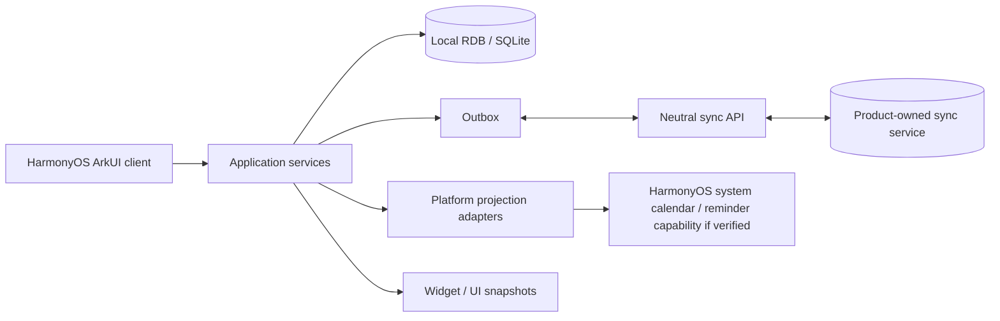

# 知行 HarmonyOS 客户端架构与迁移边界

## 1. 目标架构

这张图描述目标，不代表任一节点已实现。和 Apple 端一致：本机数据库的事务成功、outbox 已入队、同步请求成功、对端已合并、系统投影成功、Widget 已刷新是不同证据层。

## 2. 未来工程模块建议

| 模块 | 类型 | 责任 | 禁止承担 |
|---|---|---|---|
| `entry` | HAP | UIAbility、启动、导航、权限入口、产品装配 | 领域规则、直接 SQL 拼接、跨端协议定义 |
| `shared/domain` | HAR 或小型共享 module | 领域 DTO、校验、纯日期/倒数计算、commands | 系统 API、全局 UI 状态 |
| `shared/data` | HAR/HSP，按实际依赖决定 | RDB repositories、migrations、outbox/inbox | UI 组件、平台日历 ID 的云同步 |
| `shared/sync` | HAR | API client、auth adapter、envelope 合并和重试 | 把 token 写入日志/fixture |
| `shared/projection` | HAR | 已验证系统能力的 adapter interface 与本机 binding | 以 projection 成功替代领域写入 |
| `feature/*` | 可选 HAP | 只有清晰独立的按需加载/隔离需求后再分包 | 为“架构好看”过早拆包 |

实际 HarmonyOS 工程的 HAP/HAR/HSP 选择必须从 DevEco Studio 当前版本的官方模块语义和构建产物验证后决定。第一版不要为了跨端而做多 HAP。

## 3. 数据模型和迁移

HarmonyOS 端采用 RDB 保存产品数据，原因是官方数据管理能力提供以 SQLite 为基础的关系型存储，适合任务、使命、打卡、历史记录、outbox 和 tombstone。偏好设置只承载小型配置，不承载可合并业务记录。

迁移必须遵守：

1. schema version 与 Swift/Kotlin 侧共享演进说明；每次 migration 可前向执行且有 fixture。
2. task/mission/habit/checkin/countdown rule 的 `id` 是领域 UUID，永不使用行号、bundle ID 或系统事件 ID。
3. 删除采用 tombstone，并携带版本/排序键，直到所有已知客户端都有机会收到删除。
4. 系统日历/提醒的 local binding 使用单独表，以 `(domainUUID, provider, localProfile)` 标识；不上传该表的设备专属 ID。
5. 加密、文件保护、备份与账号隔离按当前 HarmonyOS 安全/数据 API 实测决定；在验收前不把任何默认行为称为跨设备加密同步。

## 4. Apple 迁移映射

| Apple 现有层 | HarmonyOS 对应策略 | 现在能否直接复用 |
|---|---|---|
| Swift `Core/Domain` | 将语义写为 JSON schema + fixtures，再用 ArkTS 重实现 | 否，复用合同而非 Swift 文件 |
| GRDB migrations / repositories | RDB schema、migration runner、repository interface | 否；表结构和迁移用例可复用 |
| CloudKitSyncEngine | 中立 sync client + 服务端 envelope | 否；CloudKit 不是非 Apple 客户端主同步通道 |
| EventKit / ReminderRepository | 有官方且真机验证的 HarmonyOS adapter | 否；能力、权限与字段模型待核验 |
| SwiftUI Feature views | ArkUI screens，遵守同一信息架构和验收语义 | 否 |
| WidgetKit snapshot | HarmonyOS 端 widget/卡片机制（待当前 API 验证） | 只可复用 snapshot JSON contract |
| macOS CLI / local Broker / DMG | 无对等迁移 | 否，明确排除 |

## 5. 迁移切片顺序

1. **合同冻结**：倒数日期、任务完成、使命进度、习惯打卡和错误 JSON fixtures。
2. **离线只读**：RDB migration + fixture import + 倒数/任务浏览；无账号、无日历写入。
3. **离线写入**：命令校验、transaction、outbox、重启恢复、软删除。
4. **同步**：匿名测试账户上的 outbox/inbox，顺序错乱、重复投递、冲突、删除 fixture。
5. **系统投影**：先读取/权限状态，再由用户显式选择目标；失败可重试且不可破坏核心记录。
6. **卡片/后台/发布**：均需要对应真机和发布环境证据。

每个切片由一条短寿命分支完成，并同时提供：测试、迁移影响、数据兼容性、可回滚方式和未验证边界。禁止以“UI 已显示”宣布同步/日历可用。

## 6. HarmonyOS 特有待确认项

以下项目尚未作为本项目已验证能力，应在 H2/H4 真机阶段逐项查询当前官方 API 并做原型：

- 系统日历、提醒或等价能力是否向第三方应用开放，所需权限、读写限制、稳定 ID 和重装后重关联策略。
- 本地/云端帐号隔离、RDB 加密、备份、后台任务、推送和设备间协同的当前 API 及分发资格。
- Service Widget / 卡片的多尺寸、刷新预算、深链、交互写入和锁屏状态限制。
- 国内分发、签名、隐私合规、审核与目标 API 的实时要求。

这些都不能通过 Apple 或 Android 的知识类推。每项结论必须附带访问日期、官方 URL、测试设备/API 与证据层级。

