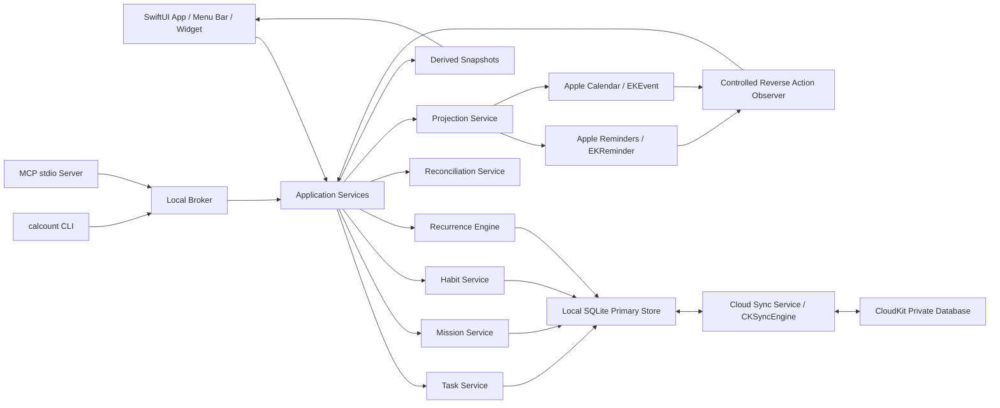

# CalendarCountdown 2.0：任务、使命与打卡完整设计图纸

> 文档状态：实施中（领域、SQLite、App/CLI 已落地；CloudKit CKSyncEngine 与真实多设备 iCloud 验收仍待生产环境）
> 编制日期：2026-09-10
> 平台：Mac / iPhone / iPad 是同一个 App；macOS 为主力与先发端
> 交付对象：后续实现者（Grok）
> 核心约束：CalendarCountdown 领域数据优先、本机离线可用、CloudKit 记录级同步、Apple 日历/提醒事项作为系统投影、CLI/AI 一等公民、所有写入可预演和可审计。

---

## 0. 一页结论

这次升级不应把 TickTick 原样复制进 CalendarCountdown，而应建立属于 CalendarCountdown 的独立任务系统，再深度投影到 Apple 生态：

- **任务 Task**：一件可以被完成的事情。SQLite 中的 Task/Occurrence 是事实源；系统需要展示或完成入口时投影为 `EKReminder`，需要占据时间段时投影为 `EKEvent`。
- **使命 Mission**：一个有边界、最终可以完成的长期结果。使命和任务关系保存在 SQLite，并通过 CloudKit 同步；可选择映射到 Apple 提醒事项清单作为系统视图。
- **打卡 Habit**：需要持续重复、关注一致性而非“最终做完”的行为。习惯定义与打卡记录属于核心数据库，可选择将周期提醒和达标记录投影到 Apple 系统。
- **倒数 Countdown**：追踪意图与本工具管理的规则保存在 SQLite，并通过 CloudKit 同步；事件正文仍以 Apple 日历为内容事实源。

需要出现在 Apple 系统中的任务，采用“一个核心对象、零到两个投影”的结构：

1. SQLite TaskOccurrence 保存完整任务与完成状态，是任务事实源；
2. `EKReminder` 是可选的可完成投影，macOS 15+ 会在 Apple 日历中展示计划提醒事项；
3. `EKEvent` 是可选的开始—结束时间块投影；
4. 投影通过稳定的 `calendarcountdown://task/<UUID>/occurrence/<key>` URL 关联。

采用**本地优先、云端复制、系统投影**：每台设备拥有自己的 SQLite 数据库；数据库中的逻辑记录通过 CloudKit private database 做记录级同步；Apple Calendar/Reminders 只保存方便用户在系统中查看和操作的投影。不得把正在使用的 SQLite 文件直接放进 iCloud Drive 让多设备共同打开。

核心系统记录是 CalendarCountdown 自己的数据模型，而不是某一个 SQLite 文件或某一个 CloudKit record。SQLite 是每台设备的离线操作副本，CloudKit 是设备间的复制与备份通道。发生离线并发时，按本文件的合并规则收敛。日历和提醒事项投影损坏或被删除，不得导致核心任务、使命和打卡记录丢失。

最重要的产品创新是使命进度：

```text
计划总量 = Σ（任务实例工作量）
已完成量 = Σ（已完成任务实例工作量）
使命进度 = 已完成量 ÷ 计划总量
```

默认每个一次性任务为 1 点；有限循环任务按实际计划次数计点；用户可将任务估算为 1、2、3、5、8 点。新增任务会增加分母，因此进度自然稀释。无限循环习惯不进入“可完成使命”的百分比分母，而显示在独立的“持续性”指标中。

---

## 1. 当前工程基线与改造范围

当前项目已经具备以下可复用基础：

- `CalendarCountdownCore` 静态共享核心；
- `CalendarCountdownCalendar` EventKit 桥接层；
- SwiftUI macOS App、WidgetKit 和 `calcount` CLI；
- Apple 日历事件读写、倒数选择、农历投影、JSON 导入导出；
- App Group JSON、稳定 URL、JSON envelope 和明确退出码。

当前实现的关键限制：

- 部署目标仍是 macOS 14；Apple 日历从 macOS 15 才原生展示、编辑和完成计划提醒事项；
- EventKit 桥接层目前只处理 `EKEvent`，尚未实现 `EKReminder`；
- `RecurrenceKind` 只有 `none/yearly`，不能表达日、周、月、自定义日期、次数结束和按完成时间循环；
- 当前“记录”是事件投影辅助数据，不是完整任务模型；
- CLI 仍可能单独遭遇 TCC 权限，且没有 MCP 服务；
- App 与 CLI 的可见列表语义曾存在差异，2.0 必须统一走同一应用服务层。

本次改造应保留现有“倒数/纪念日”能力，不应将它强行改造成任务。一级模块与当前 macOS `RootView` 侧栏一致：

```text
倒数日 / 任务清单 / 使命清单 / 打卡
```

设置、同步状态和 Apple 日历权限是二级入口，不是第五个一级 tab。Mac、iPhone、iPad 共用这一信息架构。

---

## 2. 产品原则

### 2.1 CalendarCountdown 领域数据优先

Mission、Habit、Task、Check-in 以及倒数追踪意图/本工具管理规则的完整业务状态以本机 SQLite 为准，并通过 CloudKit 做记录级同步。Apple 提醒事项和日历是系统投影（倒数事件正文仍以 Apple 日历为内容事实源），不承担核心数据恢复责任。

应用必须离线可写。网络恢复后由同步引擎上传本地变更并合并远端变更；CloudKit 不可用时不影响本机查看、创建和完成任务。

### 2.2 不把 Markdown 和机器元数据混在一起

- SQLite 保存用户的 Markdown 原文；
- `EKReminder.notes` 和 `EKEvent.notes` 只保存面向用户可读的投影副本；
- App 使用 Markdown 渲染器展示；
- Apple 提醒事项中仍能看到可读原文；
- 机器字段不得以不可读代码块偷偷塞入 notes；
- `URL` 只保存稳定对象链接，不保存大段 JSON。

### 2.3 派生数据可重建

Apple EventKit 投影、Widget 快照、今日视图缓存、统计缓存和搜索索引都不是事实源，删除后必须能从 SQLite 重建；SQLite 丢失时可从 CloudKit 恢复核心记录。

### 2.4 开放优先

所有 GUI 核心操作必须同时具备：

- Swift 领域服务调用；
- 稳定 JSON CLI；
- MCP stdio 工具；
- JSON Schema；
- 可导入、可导出、可预演；
- 人工操作和 AI 操作使用相同校验与写入路径。

### 2.5 不伪造可靠性

“SQLite 事务成功”“CloudKit 已上传”“另一设备已收敛”“EventKit 投影成功”“Apple 原生 App 可见”“Widget 已刷新”“AI 端到端可调用”是不同验收层，必须分别验证。

---

## 3. 总体架构



建议模块边界：

```text
Source/
  Core/
    Domain/
      TaskModels.swift
      RecurrenceModels.swift
      MissionModels.swift
      HabitModels.swift
      ProgressCalculator.swift
    Contracts/
      RepositoryProtocols.swift
      CommandContracts.swift
      ErrorContracts.swift
    Persistence/
      Database/
        AppDatabase.swift
        DatabaseMigrations.swift
        Records.swift
        Repositories.swift
      SnapshotStores.swift
  AppleBridge/
    EventStoreAccess.swift
    ReminderRepository.swift
    CalendarProjectionRepository.swift
    EventKitMapping.swift
    EventKitChangeObserver.swift
  CloudSync/
    CloudKitSchema.swift
    CloudSyncService.swift
    CloudMergePolicy.swift
    CloudAccountCoordinator.swift
  Services/
    TaskService.swift
    RecurrenceService.swift
    MissionService.swift
    HabitService.swift
    ReconciliationService.swift
    ExportImportService.swift
  App/
    Features/Tasks/
    Features/Missions/
    Features/Habits/
    Features/Today/
  Automation/
    LocalBroker.swift
    MCPServer.swift
  CLI/
    CalCountCLI.swift
```

`CalendarCountdownCalendar` 可更名为 `CalendarCountdownAppleBridge`，但不是首批必须项；优先拆职责，避免一次性大重命名制造无关 diff。

---

## 4. 数据归属图

| 数据 | 核心权威来源 | CloudKit | Apple 系统中的角色 |
|---|---|---:|---|
| 任务标题、Markdown 描述 | SQLite | 同步 | Reminder/Event 可读副本 |
| 开始、到期、时间段 | SQLite | 同步 | Reminder/Event 时间投影 |
| 完成状态、完成时间 | SQLite | 同步 | Reminder 提供受控完成入口 |
| 优先级、提醒 | SQLite | 同步 | 投影到 Reminder |
| 任务所属使命 | SQLite | 同步 | 可映射为 Reminder list |
| 固定/完成后循环规则 | SQLite | 同步 | 只投影实际 occurrence |
| 循环实际实例 | SQLite | 同步 | 每个实例可投影为独立 Reminder/Event |
| 使命标题、说明、状态、权重 | SQLite | 同步 | 可选目标日事件/Reminder list |
| 习惯定义、目标、周期规则 | SQLite | 同步 | 可选周期 Reminder |
| 每次打卡时间、数值、备注 | SQLite | 同步 | 可选打卡 Event，不是恢复依据 |
| 本工具管理的倒数/生日规则 | SQLite | 同步 `CDManagedEvent`（剥离本机 calendarIdentifier） | 事件正文写入用户选择的 Apple 日历 |
| 倒数追踪选择 | SQLite | 同步 `CDCountdownSelection`（不上传 EventKit identifier） | 在本机日历按标题/URL/日期重连 |
| 倒数置顶 | SQLite | 同步 `CDCountdownPreferences` | 本机展示 |
| 隐藏的 Apple 日历类别 | SQLite `countdown_hidden_calendars` | 不同步 | 仅本机显隐 |
| Apple projection identifier | 本机 SQLite | 不作为全局 ID | 仅当前设备加速索引 |
| 稳定领域 UUID | SQLite | 同步 | 写入 EventKit URL 用于跨设备重连 |
| 使命进度、习惯统计 | SQLite 派生 | 不同步结果 | 各设备从相同原始记录重算 |
| Widget/今日列表 | 派生快照 | 不同步 | 本机展示缓存 |

### 4.1 SQLite 选型

推荐使用 **SQLite + GRDB.swift**，并在实现时固定经过验证的版本：

- SQLite 文件透明、单文件、容易备份和导出；
- GRDB 提供显式 migration、事务、WAL 并发、类型安全记录和数据库观察；
- 相比 SwiftData，更适合 CLI/MCP 合同、显式 SQL、可预测迁移和故障诊断；
- App 是唯一写入进程，CLI/MCP 经 Broker 调用 App；Widget 不直接打开数据库，只读快照。

如果实现者拒绝引入第三方依赖，可以改用系统 `SQLite3`，但必须自己补齐 migration、事务封装、busy handling、备份和测试；不得退回多个互相关联的 JSON 文件。

建议文件：

```text
~/Library/Group Containers/<app-group>/CalendarCountdown/
  calendarcountdown-v2.sqlite
  calendarcountdown-v2.sqlite-wal
  calendarcountdown-v2.sqlite-shm
  Backups/
  widget-snapshot-v2.json
```

运行设置：

- WAL mode；
- `foreign_keys = ON`；
- 设置合理的 `busy_timeout`；
- 同一进程、同一标准化路径只 intern 一个 `DatabasePool`（`AppDatabasePoolRegistry`）；
- 库文件、WAL、SHM、父目录和 `Backups/` 设置 `isExcludedFromBackup = true`；
- iOS 另设 `FileProtectionType.completeUntilFirstUserAuthentication`；
- migration 前使用 SQLite backup API 生成可恢复备份；
- 数据库和备份仅当前用户可读写；
- operation journal 与领域更新在同一数据库事务中提交；
- Widget 快照仍使用原子 JSON，因为 Widget 不应持有数据库写锁。

### 4.2 数据库表设计

```text
schema_migrations
  version, applied_at

missions
  id PK, title, description_md, color, icon, status,
  target_date, default_workload, sort_key,
  created_at, updated_at, revision, modified_by_device, deleted_at

task_series
  id PK, title, description_md, kind, mission_id FK,
  priority, recurrence_mode, rrule,
  recurrence_end_kind, recurrence_end_value, workload,
  time_zone, invalid_date_policy, projection_policy,
  created_at, updated_at, revision, modified_by_device, deleted_at

task_occurrences
  id PK, series_id FK, occurrence_key UNIQUE,
  title_override, description_override_md,
  planned_start, planned_due, status, completed_at,
  disposition, created_at, updated_at, revision,
  modified_by_device, deleted_at

habits
  id PK, title, description_md, metric, target_value, unit,
  schedule_rule, active_from, active_until,
  allow_backfill_days, completion_policy, projection_policy,
  created_at, updated_at, revision, modified_by_device, deleted_at

habit_periods
  habit_id FK, period_key,
  target_value_snapshot, disposition, completed_at,
  updated_at, revision, modified_by_device, deleted_at,
  PRIMARY KEY (habit_id, period_key)

checkins
  id PK, habit_id FK, period_key,
  value, unit, effective_at, recorded_at, source, note,
  created_at, updated_at, revision, modified_by_device, deleted_at

managed_events                       # 本工具管理的倒数/生日规则
  id PK, external_id, title, calendar_title,
  calendar_identifier,               # 仅本机
  calendar_system, recurrence, date, time,
  start_year, lunar_month, lunar_day,
  lunar_leap_month_policy, invalid_lunar_day_policy,
  is_all_day, alert_days_json, notes, select_for_countdown,
  created_at, updated_at, revision, modified_by_device, deleted_at

countdown_selections                 # 追踪意图
  id PK, mode,
  calendar_identifier, event_identifier,  # 仅本机 EventKit ID
  calendar_title, event_title,
  external_identifier, managed_record_id, occurrence_date,
  selected_at, updated_at, revision, modified_by_device, deleted_at

countdown_preferences                # 置顶；隐藏日历不在此表同步
  id PK, pinned_selection_id,
  revision, updated_at, modified_by_device

countdown_hidden_calendars           # 仅本机，不上传 CloudKit
  calendar_identifier PK, updated_at

projection_bindings                  # 仅本机，不上传 CloudKit
  domain_type, domain_id, projection_kind,
  apple_identifier, apple_external_identifier,
  desired_revision, projected_revision, fingerprint,
  last_seen_at, state, error_code,
  PRIMARY KEY (domain_type, domain_id, projection_kind)

projection_settings                 # 用户配置，同步
  id PK, project_tasks, project_habits, project_missions,
  accept_native_completion, accept_native_schedule_changes,
  revision, updated_at, modified_by_device

projection_destinations            # 仅本机，不上传 CloudKit
  projection_kind PK, apple_calendar_identifier,
  apple_calendar_title, apple_source_identifier, updated_at

idempotency_keys
  key PK, command_name, request_hash, response_json,
  created_at, expires_at

cloud_outbox                        # 仅本机
  id PK, record_type, record_name, operation,
  local_revision, enqueued_at, retry_count, last_error_code

cloud_sync_state                    # 仅本机
  scope PK, ck_state_serialization, account_identifier_hash,
  last_fetch_at, last_send_at

field_versions
  object_type, object_id, field_name, hlc, modified_by_device,
  PRIMARY KEY (object_type, object_id, field_name)

merge_conflicts
  id PK, object_type, object_id, field_name,
  local_value, remote_value, ancestor_value,
  detected_at, resolution, resolved_at

operation_journal
  sequence PK, request_id, actor, command, object_type, object_id,
  before_revision, after_revision, effect_summary, created_at

pending_operations
  id PK, request_id UNIQUE, command, object_type, object_id,
  stage, started_at, updated_at, retry_count, last_error_code
```

说明：

- 标题、Markdown、时间、完成态和打卡值现在全部由 SQLite 保存并同步；
- 倒数规则与追踪意图同样由 SQLite 保存并同步；EventKit identifier 只留在本机列，不进 CloudKit payload；
- Apple identifier 只进入本机 `projection_bindings`，不能成为跨设备主键；
- CloudKit recordName 直接使用稳定领域 UUID；
- `deleted_at` 是跨设备删除 tombstone，保留期结束后再物理清理；
- `response_json` 必须有过期清理策略，且不得缓存敏感正文；
- `pending_operations` 不保存标题和 Markdown，只保存稳定 ID 与执行阶段；
- 所有外键明确 delete policy，禁止依赖默认级联。

### 4.3 唯一事实源规则

SQLite 是所有业务字段的本机权威来源，CloudKit 负责让多台设备的 SQLite 副本最终收敛。倒数事件正文仍以 Apple 日历为内容事实源；SQLite/CloudKit 只保存规则、追踪意图和置顶。Apple 侧变化按以下白名单处理：

- 在 Reminder 中完成/取消完成：默认转换为核心数据库的 complete/reopen 命令；
- 在 Calendar 中移动时间：默认提示用户“采用系统修改”或“恢复应用计划”，可在设置中允许自动采用；
- 在 Apple 中修改标题、notes、优先级：默认视为 projection drift，不直接覆盖核心数据；用户可手动选择“采用此次修改”；
- 删除 Apple 投影：只标记投影缺失，不删除核心对象；
- SQLite 变更后更新投影；投影损坏时可完整重建；
- SQLite 损坏时从本机备份或 CloudKit 恢复，不依赖 Apple 投影做完整恢复；
- 对账报告区分 `projectedCoreChange`、`adoptedNativeAction`、`projectionDrift`、`missingProjection` 和 `conflict`。

### 4.4 CloudKit 不是共享 SQLite 文件

每台设备使用独立本地文件：

```text
Mac A SQLite ─┐
              ├─ CKSyncEngine ↔ CloudKit private database
iPhone SQLite ┤
              │
iPad SQLite ──┘
```

CloudKit 中同步的是 Mission、TaskSeries、TaskOccurrence、Habit、HabitPeriod、CheckIn、ManagedEvent、CountdownSelection、CountdownPreferences、ProjectionSettings 等逻辑 record，不上传 `.sqlite`、`.sqlite-wal` 或 `.sqlite-shm` 文件。不上传 Apple 日历事件正文，也不上传本机 EventKit identifier。

这样才能同时获得：

- 本机事务、索引和离线能力；
- 多设备记录级增量同步；
- 冲突定位到单条记录或单个字段；
- 一台设备损坏时从云端重新建立本地数据库；
- 不受 iCloud Drive 冲突副本和 WAL 文件不同步影响。

---

## 5. 统一身份与链接

每个领域对象使用应用生成的稳定 UUID，不依赖 EventKit identifier 的永久稳定性。

```text
calendarcountdown://task/<task-series-uuid>
calendarcountdown://task/<task-series-uuid>/occurrence/<occurrence-key>
calendarcountdown://mission/<mission-uuid>
calendarcountdown://habit/<habit-uuid>
calendarcountdown://habit/<habit-uuid>/checkin/<checkin-uuid>
```

每次同步按以下顺序重新关联：

1. URL 中的稳定 UUID；
2. 已记录的 `calendarItemIdentifier`；
3. 外部标识、清单、日期和标题的受限组合匹配；
4. 无法唯一匹配时进入“待修复”，不得猜测绑定。

`calendarItemIdentifier` 只作加速索引，不能作为导入导出主键。

---

## 6. 任务模块

### 6.1 任务类型

用户层只需要理解两种：

#### A. 截止任务 `deadline`

示例：“今天 15:00 去剔牙”。

- SQLite 保存 TaskSeries 和 TaskOccurrence；
- 开启系统投影时创建 `EKReminder`，将到期时间投影到 `dueDateComponents`；
- 在 macOS 15+ Apple 日历的“计划提醒事项”中可见；
- 可以在本 App 中完成；若开启原生完成回写，也可以在提醒事项或日历中完成。

#### B. 时间段任务 `timeWindow`

示例：“今天 14:00 至后天 03:00，参与特别吃饭行动”。

- SQLite 保存完整任务、开始、结束和完成状态；
- 可选 `EKReminder`：显示截止点并提供系统完成入口；
- `EKEvent`：投影开始和结束，显示为日历时间块；
- 完成 Reminder 不删除 Event，Event 改为已完成视觉状态只在本 App 中体现；
- 删除核心任务默认同时移除投影；也可选择“保留为普通日历事件”，此时移除 CalendarCountdown URL 关联。

不建议把“持续三天”解释成“长期使命”。持续时间与长期目标是两个正交概念。

### 6.2 字段

```swift
TaskSeries {
  id: UUID
  kind: deadline | timeWindow
  title: String
  markdownDescription: String?
  missionID: UUID?
  priority: none | low | medium | high
  workload: 1 | 2 | 3 | 5 | 8
  schedule: TaskSchedule
  recurrence: RecurrenceSpec?
  alerts: [AlertSpec]
  projectionPolicy: none | reminder | calendar | both
  createdAt: Instant
  updatedAt: Instant
}

TaskOccurrence {
  seriesID: UUID
  occurrenceKey: String
  plannedStart: Instant?
  plannedDue: Instant?
  completedAt: Instant?
  status: open | completed | canceled | skipped
}
```

`title`、`markdownDescription`、实际日期和完成态全部从 SQLite 读取；EventKit identifier 由投影服务在本机合成到领域视图中。

### 6.3 Markdown 规则

支持 CommonMark 子集：

- 标题、粗体、斜体、删除线；
- 有序/无序列表；
- 任务内清单语法 `- [ ]`，首版只渲染，不映射为独立 Reminder；
- 链接和行内代码；
- 围栏代码块；
- 不执行 HTML、脚本或远程嵌入。

编辑器提供“编辑 / 预览 / 分栏”三种模式。CLI 通过 `--description-file` 或 stdin 接收 Markdown，避免 shell 转义破坏正文。

### 6.4 状态语义

- `open`：SQLite occurrence 未完成；
- `completed`：SQLite occurrence 已完成并记录 completedAt；
- `canceled`：用户取消整个实例，不计完成量；
- `skipped`：仅循环实例可用，推进循环但不计完成量；
- `overdue`：不是持久状态，是 `open && due < now` 的派生状态。

`canceled` 和 `skipped` 是 SQLite 中的正式领域状态。对应 Reminder 投影应归档或移除，不能在 Apple 侧伪装成完成。

### 6.5 编辑范围

循环任务的时间、标题、规则发生修改时，必须弹出：

- 仅此实例；
- 此实例及未来；
- 整个系列。

已完成历史默认不可被“未来修改”重写。修改整个系列也只影响未完成实例，除非用户显式选择迁移历史。

---

## 7. 循环引擎

### 7.1 为什么不能只使用 Apple 原生重复提醒

EventKit 支持日、周、月、年和按日期/次数结束的 `EKRecurrenceRule`，但 Apple 对重复提醒通常只暴露第一个未完成实例。它不能完整表达 TickTick 风格的两种关键语义：

- **按到期时间循环**：旧实例未完成时，新实例仍应按计划产生；
- **按完成时间循环**：下一实例日期从实际完成时间计算。

因此 2.0 的循环规则和全部 occurrence 由 SQLite 维护；开启系统投影的 occurrence 才写成独立 Apple 提醒事项或日历事件。不要把一个循环系列只保存为单个原生 recurring reminder。

### 7.2 规则模型

```swift
RecurrenceSpec {
  mode: fixedSchedule | afterCompletion
  frequency: daily | weekly | monthly | yearly
  interval: Int
  weekdays: [Weekday]?
  monthDays: [Int]?
  months: [Int]?
  setPositions: [Int]?
  end: never | afterOccurrences(Int) | onDate(LocalDate)
  timeZone: String
  firstWeekday: Weekday
  invalidDatePolicy: clampToMonthEnd | skip
}
```

内部导入导出同时提供标准化 RRULE 表达；`mode=afterCompletion` 作为 RRULE 之外的显式扩展字段。

### 7.3 生成策略

#### 固定计划 `fixedSchedule`

- 从初始计划日期推导，不受实际完成时间影响；
- 即使前一个实例未完成，下一个也按时生成；
- 每个实例是独立 `EKReminder`；
- 默认物化“未来 30 天或未来 10 个实例，取覆盖更大的范围”，后台滚动补齐；
- 使用确定性 `occurrenceKey = <seriesUUID>@<RFC3339 plannedDue>` 幂等创建；
- 有限循环的总次数从规则直接计算，无需预先创建全部实例。

#### 完成后循环 `afterCompletion`

- 同一时刻只创建一个未完成实例；
- 完成时以 `completionDate + interval` 计算下一次；
- “完成次数”包含当前实例；
- 跳过时以跳过时间作为下一次锚点，但不增加使命已完成量；
- 若通过 Apple 原生 App 完成，`EKEventStoreChanged` 或下次启动 reconcile 时补建下一实例。

### 7.4 月末、时区和夏令时

- 日期规则按本地日期运算，不以固定 86,400 秒加减；
- 时间段在指定 IANA 时区中生成；
- 跨 DST 时保持墙上时间，例如每周 09:00 始终为当地 09:00；
- 每月 31 日默认 `clampToMonthEnd`，也可 `skip`；
- “每月最后一个工作日”使用 `weekdays + setPositions=-1`；
- 全部时间输出 RFC 3339，全天日期输出 `YYYY-MM-DD`，禁止混用。

### 7.5 完成次数示例

```text
每周一、三，按到期循环，重复 6 次
→ 一共生成 6 个独立任务实例
→ 第 1 个未完成不阻止第 2 个出现

每 3 天，按完成后循环，重复 4 次
→ 完成第 1 次后才产生第 2 次
→ 第 2 次到期 = 第 1 次完成时间 + 3 天
```

---

## 8. 使命模块

### 8.1 产品定义

使命是“能够结束的长期成果”，例如“学会弹奏《致爱丽丝》”，而不是“每天练琴”本身。

一个使命由 SQLite 中的 Mission、TaskSeries 和 TaskOccurrence 组成。用户可以选择创建一个同名 Apple 提醒事项清单作为系统投影视图，但该清单不是使命事实源。

若用户直接在投影清单中新增 Reminder，它会进入“发现的系统任务”收件箱：默认由用户确认后导入核心数据库；只有显式开启“自动接管该清单”时才自动创建 Task。这样既支持在 Apple 原生 App 中快速录入，也避免系统投影被意外编辑后改变使命分母。

### 8.2 状态

```text
draft → active → completed
           ↘ paused
           ↘ archived
```

- `completed` 需要用户确认，不因进度瞬时达到 100% 自动封存；
- 100% 时提示“所有计划已完成，是否完成使命”；
- 已完成使命新增任务时，先询问“重新开启”或“仅作为后续维护”。

### 8.3 进度算法

默认模型为“实例工作量点数”。

```text
Total = Σ occurrence.workload，范围为所有纳入使命的有限计划实例
Done  = Σ occurrence.workload，范围为 status == completed 的实例
Progress = clamp(Done / Total, 0...1)
```

规则：

- 一次性任务默认 1 点；
- 有限循环任务：`单次工作量 × 计划次数`；
- 时间段任务仍按工作量计，不按持续小时数自动放大；
- 工作量可选 1、2、3、5、8，默认 1；
- 只有“完成”计入 Done；跳过、取消、逾期均不计；
- 新增任务或增加循环次数会增加 Total，进度立即稀释；
- 移出任务会同时移除其 Total 和 Done；
- 归档任务默认保留其贡献，显式“从使命统计中排除”才重算；
- Total 为 0 时显示“尚未规划”，而不是 0%。

例子：

```text
原计划：10 个 1 点任务，已完成 4 个 → 4/10 = 40%
新增：2 个 1 点任务              → 4/12 = 33.3%
完成其中 1 个                    → 5/12 = 41.7%
新增一个 5 点大型任务             → 5/17 = 29.4%
```

### 8.4 无限循环如何处理

无限循环没有数学上的最终总量，不能诚实地放入有限进度分母。处理方式：

- 默认不进入使命百分比；
- 在使命卡片上单独显示“持续性”，例如最近 30 天完成率、当前连续天数；
- 若用户确实希望它进入进度，必须先设定使命截止日期或目标次数，将其变成有限计划。

使命卡片显示两个互不混淆的指标：

```text
成果进度  63%   19 / 30 点
持续性    87%   最近 30 天 26 / 30
```

### 8.5 进度解释器

进度条旁必须提供“为什么是这个数字”：

- 已完成点数；
- 未完成点数；
- 最近新增导致的稀释；
- 无限循环任务为何未进入分母；
- 每项任务的权重和贡献。

这是相较只显示百分比的任务工具更重要的透明性设计。

---

## 9. 打卡模块

### 9.1 习惯类型

- `binary`：本周期做了/没做，例如“早睡”；
- `count`：累计次数，例如“喝 8 杯水”；
- `quantity`：累计数值和单位，例如“阅读 30 分钟”“跑步 5 公里”。

### 9.2 习惯规则

```swift
HabitDefinition {
  id: UUID
  title: String
  markdownDescription: String?
  metric: binary | count | quantity
  targetValue: Decimal
  unit: String?
  schedule: daily | selectedWeekdays | weeklyN | monthlyN | custom
  activeFrom: LocalDate
  activeUntil: LocalDate?
  reminders: [LocalTime]
  allowBackfillDays: Int
  completionPolicy: reachTarget | manualComplete
}
```

### 9.3 Apple 投影映射

- 当前周期提醒可投影为 `EKReminder`，在 Apple 日历中可见；
- 打卡记录可选投影为专用可隐藏日历“CalendarCountdown 打卡记录”中的零时长 `EKEvent`；
- 事件 URL 包含 habitID 和 checkinID；
- 标题保持可读，例如 `✓ 阅读 +20 分钟`；
- `startDate` 为实际打卡时间；
- notes 保存用户备注，不保存隐藏机器块；
- 定量值、单位、periodKey、实际时间和备注以 SQLite 为权威；事件标题保持可读，URL 保留稳定关联，但 EventKit 不承担完整恢复职责。

打卡记录日历由用户选择或首次启用时明确创建。不得静默向现有私人日历写大量日志。

### 9.4 打卡动作

- 快速打卡：按默认增量记录；
- 定量打卡：输入本次数值；
- 一键达标：补足到本周期目标；
- 补打：允许在配置范围内选择过去周期；
- 撤销：在 SQLite 中 tombstone 对应 CheckIn、重新计算周期，并移除其 Apple 投影；
- 编辑：改数值或时间；
- 跳过：记录 skipped，不计成功也不打断“允许休息日”的计划。

若已开启 Reminder 投影，本周期累计值达到目标时自动完成对应投影。若用户直接在 Apple 日历/提醒事项中完成周期 Reminder：

- binary 习惯：视为本周期完成，补建一次系统来源的 check-in；
- count/quantity 习惯：视为“一键达标”，补足剩余值并标记来源为 `appleCompletion`；
- 用户随后可在 App 中修正实际数值。

### 9.5 统计

- 当前连续达标周期；
- 最长连续达标周期；
- 本周/本月达标率；
- 累计值与平均值；
- 日历热力图；
- 跳过与休息日不计入失败；
- 补打记录保留 `recordedAt` 与 `effectiveAt`，避免伪造原始时间。

打卡与使命的关系：习惯默认只进入“持续性”，不进入使命成果百分比；有限次数的练习计划应建成有限循环任务，而不是无限习惯。

---

## 10. 信息架构与界面

### 10.1 主导航

```text
┌──────────────────┬────────────────────────────────────────┐
│ 倒数日           │ 顶部：快速添加 / 搜索 / 同步状态      │
│ 任务清单         │                                        │
│   今天（筛选）   │ 主列表 / 时间线 / 详情检查器           │
│   收集箱         │                                        │
│   计划内         │                                        │
│   已完成         │                                        │
│ 使命清单         │                                        │
│ 打卡             │                                        │
│ 设置 / 同步      │ 二级入口，不是一级 tab                 │
│ Apple 日历权限   │ 二级入口                               │
└──────────────────┴────────────────────────────────────────┘
```

一级入口只有四个：倒数日、任务清单、使命清单、打卡。“今天”只作为任务清单内部筛选/摘要。不设置“更多”，也不把倒数放进“更多”。

### 10.2 快速添加

支持自然语言，但必须“解析后预览再保存”：

```text
输入：后天下午三点剔牙，每三个月完成后再提醒，加入健康使命

预览：
标题       剔牙
首次到期   2026-09-12 15:00 Asia/Shanghai
循环       每 3 个月，按完成时间
使命       健康
核心保存   CalendarCountdown SQLite → CloudKit
系统投影   Apple 提醒事项「CalendarCountdown 任务」
```

任何低置信度字段高亮要求确认，不能静默猜测日期、时区或使命。

### 10.3 任务列表

每行显示：完成框、标题、到期/时间段、循环图标、使命色、工作量、逾期状态。悬停显示 CloudKit 同步状态和 Apple 投影状态。

### 10.4 使命页

```text
学会钢琴曲《致爱丽丝》                     截止 2027-03-31
██████████████░░░░░░  63%                  19 / 30 点
持续性：最近 30 天练琴 26 / 30，连续 9 天

进行中  8 点    已完成 19 点    未规划风险 3 项
------------------------------------------------------------
[ ] 熟悉右手第一段                         2 点
[✓] 完成基础指法课程（6/6 次）             6 点
[ ] 每周跟老师复盘（无限循环）       不计成果进度
```

### 10.5 打卡页

顶部为最近七天日期条；每个习惯行直接完成、加量或补打。点击进入统计页，显示热力图、趋势、连续记录和全部原始打卡事件。

### 10.6 菜单栏与 Widget

- 菜单栏：今天待办数量、最近到期任务、快速完成、习惯快速打卡；
- 小组件：今日任务、使命进度、今日习惯三种独立 configuration；
- Widget 只读 App 生成快照，交互通过 App Intent 回到统一服务层；
- 现有倒数组件继续保留，不混入任务完成语义。

### 10.7 Apple 日历投影蓝图

Apple 日历是最重要的外部展示入口，但不是核心数据库：

| 核心对象 | 默认系统投影 | 日历中的表现 | 允许反向动作 |
|---|---|---|---|
| 无日期任务 | 无 | 不占日历 | 无 |
| 截止任务 | `EKReminder` | 计划提醒事项，显示到期点 | 完成/重开 |
| 时间段任务 | `EKEvent` + 可选 `EKReminder` | 时间块 + 截止点 | 完成；改期需确认或按设置采用 |
| 固定循环任务 | 每个 occurrence 独立投影 | 旧任务逾期不阻止新实例显示 | 单实例完成/重开 |
| 完成后循环任务 | 仅当前 occurrence | 完成后再出现下一实例 | 完成触发下一次 |
| 有截止日使命 | 全天 `EKEvent` | `🎯 学会钢琴 · 42%` | 默认只读投影 |
| 习惯当前周期 | 可选 `EKReminder` | 今日计划提醒事项 | 完成视为本周期达标 |
| 打卡记录 | 默认关闭的可选 `EKEvent` | `✓ 阅读 +20 分钟` | 修改需确认采用 |

默认创建或让用户选择三个独立目标：

```text
CalendarCountdown 任务      # Reminder list / task deadline projections
CalendarCountdown 使命      # Calendar / mission milestone projections
CalendarCountdown 打卡      # Calendar / optional check-in projections
```

首次启用任务投影时提示用户在 Apple 日历侧勾选“计划提醒事项”。应用不能假定该系统视图已经显示。打卡事件投影默认关闭，避免高频记录污染主日历；使命截止事件和时间段任务默认开启。

---

## 11. CLI 与 AI 接口

### 11.1 统一输出合同

成功：

```json
{
  "ok": true,
  "data": {},
  "meta": {
    "schemaVersion": 2,
    "requestId": "uuid",
    "revision": "opaque-revision"
  }
}
```

失败：

```json
{
  "ok": false,
  "error": {
    "code": "task_not_found",
    "message": "找不到任务。",
    "details": {},
    "retryable": false
  },
  "meta": { "requestId": "uuid" }
}
```

约束：

- stdout 永远只有一个 JSON 文档；诊断写 stderr；
- 未知参数必须退出 64，不能静默忽略；
- 权限错误退出 77；冲突退出 73；一般运行错误退出 1；
- 所有写命令支持 `--dry-run`、`--idempotency-key` 和 `--if-revision`；
- 大段输入支持 `--input -` 或 `--input file.json`；
- 日期时间必须携带时区；
- 列表支持 cursor 分页和稳定排序；
- 删除默认进入 30 天可恢复归档，永久删除必须显式参数。

### 11.2 命令面

```text
calcount capabilities
calcount auth status
calcount auth request --entity reminders|events|all

calcount reminder-lists list

calcount tasks list [filters]
calcount tasks get <task-id>
calcount tasks create --input task.json [--dry-run]
calcount tasks update <task-id> --input patch.json --scope this|future|series
calcount tasks complete <task-id> [--at RFC3339]
calcount tasks reopen <task-id>
calcount tasks skip <task-id>
calcount tasks archive <task-id>
calcount tasks delete <task-id> --permanent

calcount missions list
calcount missions create --input mission.json
calcount missions get <mission-id>
calcount missions update <mission-id> --input patch.json
calcount missions add-task <mission-id> <task-id>
calcount missions remove-task <mission-id> <task-id>
calcount missions progress <mission-id> --explain
calcount missions complete <mission-id>

calcount habits list
calcount habits create --input habit.json
calcount habits checkin <habit-id> [--value N] [--at RFC3339]
calcount habits undo-checkin <checkin-id>
calcount habits stats <habit-id> --from DATE --to DATE

calcount sync status
calcount sync now [--wait SECONDS]
calcount projections status
calcount projections reconcile [--dry-run]
calcount projections rebuild <object-id> [--dry-run]
calcount export --output backup.calcountbundle
calcount import backup.calcountbundle --dry-run
calcount doctor
calcount mcp serve --stdio
```

### 11.3 本地 Broker

当前 CLI 直接访问 EventKit 会拥有独立 TCC 权限，可能出现 App 已授权而 CLI 未授权。2.0 默认改为：

```text
CLI / MCP → 用户级 Unix Domain Socket → CalendarCountdown Application Services
                                      ├→ SQLite / CloudKit
                                      └→ EventKit projections
```

- socket 文件权限 `0600`；
- 校验调用进程 UID；
- token 保存在 Keychain；
- 不默认监听 TCP 端口；
- App 未运行时 CLI 可尝试后台唤起；
- 纯 schema 校验和导入预览不依赖 EventKit 权限；
- `--transport direct` 仅作诊断，不作为 AI 默认路径。

这样 App、CLI 和 MCP 使用同一个权限主体、同一服务层和同一可见性规则。

### 11.4 MCP 工具

MCP 工具与 CLI 领域动作一一对应，首版至少提供：

```text
tasks.list / tasks.get / tasks.create / tasks.update
tasks.complete / tasks.reopen / tasks.skip
missions.list / missions.get / missions.create / missions.progress
habits.list / habits.checkin / habits.stats
sync.status / sync.now
projections.status / projections.reconcile
system.capabilities / system.doctor
```

每个写工具返回 `preview`、`effects` 和 `revision`。AI 不得通过拼接 notes 或直接操作 JSON 文件绕过服务层。

---

## 12. 导入、导出与开放格式

导出包后缀：`.calcountbundle`，本质为 ZIP：

```text
manifest.json
extensions-v2.json          # 从 SQLite 导出的可移植逻辑快照，不是原始数据库文件
tasks.json
missions.json
habits.json
checkins.json
calendar-events.ics       # 可选
reminders.ics             # 若系统导出能力不足则保留 canonical JSON
checksums.sha256
```

要求：

- `manifest.json` 声明 schema、导出时间、App 版本和来源时区；
- 不直接打包运行中的 `.sqlite-wal/.sqlite-shm`；通过一致性事务导出 canonical JSON；
- 所有 ID 保持稳定；
- 导入先做纯文件/schema 校验，再做 SQLite 合并预览，确认后提交核心数据并进入 CloudKit outbox；Apple 投影是随后可单独预演和执行的阶段；
- 幂等重导不得重复创建；
- 导出中不得包含本机绝对路径、token 或权限信息；
- JSON Schema 和示例进入公开仓库；
- 提供从 Apple 提醒事项清单“接管为使命”的导入能力，不要求用户重新录入。

---

## 13. CloudKit 同步、Apple 投影与冲突

### 13.1 本地写入主路径

所有 App、CLI、MCP 操作先完成本地 SQLite 事务：

1. 校验命令和 expected revision；
2. 修改领域记录；
3. 写 operation journal；
4. 向 `cloud_outbox` 写入对应 recordName 和 revision；
5. 提交事务并立即更新 UI；
6. 异步触发 CloudKit 同步与 Apple 投影。

用户操作不等待网络。界面分别显示 `仅本机`、`等待同步`、`已同步`、`冲突`、`iCloud 不可用`。

### 13.2 CloudKit 实现

- 使用用户的 CloudKit private database；
- 创建专用 custom record zone `CalendarCountdownZone`；
- 使用 `CKSyncEngine` 调度 record zone 的增量拉取和推送；
- 将最新 `CKSyncEngine.State.Serialization` 与本地数据库一起持久化；
- App 启动、回到前台、收到 remote notification、用户手动刷新时触发同步；
- 需要读到最新结果的显式操作可以请求立即 fetch/send，但不能承诺实时到达；
- 网络错误、限流和服务不可用进入重试；`serverRecordChanged` 必须由应用合并；
- 开发和生产 CloudKit schema 分离，正式发布前必须部署 production schema。
- CloudKit 是同步副本，不替代用户可下载的 `.calcountbundle` 备份。

CloudKit record types：

```text
CDMission
CDTaskSeries
CDTaskOccurrence
CDHabit
CDHabitPeriod
CDCheckIn
CDManagedEvent              # 本工具倒数规则；剥离 calendarIdentifier
CDCountdownSelection        # 追踪意图；不上传 eventIdentifier/calendarIdentifier
CDCountdownPreferences      # 置顶；不含隐藏日历列表
CDProjectionSettings
CDProjectionLease
CDTombstone                 # 也可并入各 record 的 deletedAt
```

recordName 直接使用领域 UUID；关系使用稳定 UUID/CKRecord.Reference，但本地 SQLite 外键仍是完整性权威。

### 13.3 多设备冲突合并

不能只依赖设备物理时间做整条记录 last-write-wins。每条可编辑记录保留 revision、设备 ID 和字段级逻辑版本；CloudKit `serverRecordChanged` 时进行三方合并：ancestor、server、client。

- 不同字段分别修改：自动合并；
- 同一字段并发修改：使用 Hybrid Logical Clock 排序，并在 journal 保留被覆盖值的摘要；
- 完成/重开：作为显式状态操作合并，较新的操作获胜，不能用旧设备的普通 update 意外重开；
- CheckIn：默认追加型；相同 UUID 幂等，删除使用 tombstone；
- 删除：tombstone 胜过更旧修改，显式 restore 可以产生更高版本；
- 排序：使用可分割 sort key，不同步数组下标；
- Mission progress、streak、统计缓存：不上传，各设备从原始记录重算；
- 无法安全自动合并的 Markdown 同字段修改：保留双方版本并进入冲突中心。

### 13.4 iCloud 账号变化

`CKSyncEngine` 检测到登录、退出或更换账号时会重置内部同步状态，应用必须显式处理：

- 每个 iCloud account 使用独立的本地数据库 profile；
- 退出账号不删除原数据库，转为锁定的本地档案；
- 切换账号不得自动把 A 账号任务上传到 B 账号；
- 未上传 outbox 先提示导出、保留本机或稍后重试；
- 用户选择“仅本机模式”时禁用 CloudKit，但 SQLite 正常工作。

### 13.5 Apple 投影触发与对账

- 本地领域事务完成；
- CloudKit 合并了远端变化；
- App 启动/回到前台；
- `EKEventStoreChanged`；
- 用户手动“修复系统投影”；
- 后台生成新 occurrence；
- Widget 快照刷新前。

投影对账顺序：

1. 从 SQLite 计算 desired projections；
2. 读取本机 EventKit 中带 CalendarCountdown URL 的 Reminder/Event；
3. 按稳定 UUID 关联，Apple identifier 只作本机缓存；
4. 识别缺失、漂移、重复和孤儿投影；
5. 先处理允许反向写入的完成/重开动作；
6. 将核心最新 revision 投影到 Apple；
7. 更新本机 `projection_bindings` 和 Widget 快照；
8. 输出 projection reconciliation report。

### 13.6 防止多设备重复投影

Apple Calendar/Reminders 本身可能通过 iCloud、CalDAV 或 Exchange 同步，所以通常只需要一台设备写入投影。每个用户维护一个 `CDProjectionLease`：

- 默认由最近活跃且拥有对应 EventKit 权限的 Mac 担任 projection writer；
- lease 使用 CloudKit record change tag 做条件更新，定期续租；
- writer 离线或权限失效后，其他设备可接管；
- 创建前仍必须在 EventKit 中按稳定 URL 查重；
- 崩溃发生在 EventKit 写入之后、CloudKit 标记之前时，下任 writer 通过 URL 发现既有投影并接管；
- 发现重复投影时保留确定性 survivor，其余先进入修复预览，不静默删除。

首发若只有 macOS 客户端，可先固定“当前 Mac 为 writer”，但数据库和 CloudKit schema 必须保留 lease 升级路径。

### 13.7 SQLite、CloudKit 与 EventKit Saga

三套存储无法组成一个原子事务。创建时间段任务采用可恢复 Saga：

1. SQLite 事务创建核心 Task/Occurrence、outbox 和 `pending_operation`；
2. 本地结果立即对用户可见；
3. CloudKit 异步上传核心 record；
4. projection writer 创建带稳定 URL 的 Reminder；
5. projection writer 创建带同一稳定 URL 的 Event；
6. SQLite 更新本机 projection binding，并将 pending 标记 completed；
7. 任一步失败只影响对应同步/投影状态，不回滚已经提交的核心任务；
8. App 重启后扫描 pending/outbox，通过稳定 UUID 继续、重试或修复。

核心数据成功与投影成功必须分开报告。幂等性由领域 UUID、occurrenceKey、request id 和 CloudKit recordName 共同保证。

---

## 14. 权限、隐私与安全

### 14.1 权限

需要新增：

- iCloud / CloudKit capability 与专用 container；
- Background Modes 的 remote notifications；
- `NSRemindersFullAccessUsageDescription`；
- Reminders 对应 entitlement/能力核验；
- 保留 `NSCalendarsFullAccessUsageDescription`；
- `doctor` 分开报告 events 和 reminders 权限。

首次启动按功能渐进请求：

- 首次引导明确选择“iCloud 跨设备同步”或“仅本机”；
- 用户只在本 App 内管理数据时，不请求 EventKit 权限；
- 开启任务 Reminder 投影时请求 Reminders；
- 开启时间段/使命/打卡 Calendar 投影时请求 Calendar；
- 权限被拒时提供系统设置入口和降级说明。

### 14.2 隐私

- 开启 iCloud 同步后，Mission、Habit、Task、CheckIn、ManagedEvent、CountdownSelection 和 CountdownPreferences 的核心字段会上传到用户自己的 CloudKit private database；必须在引导页明确说明。不上传 Apple 日历事件正文，也不上传本机 EventKit identifier；
- 不上传到 CalendarCountdown 自建服务器或第三方分析服务；
- 关闭 iCloud 同步时数据只保存在本机 SQLite；
- Apple 日历/提醒事项投影是否跨设备出现，取决于用户为目标日历/清单选择的 Apple 账号；
- MCP/CLI 是本机接口；
- AI 调用必须由用户在宿主环境显式授权；
- operation journal 记录动作类型和对象 UUID，默认不复制正文；
- 导出前显示数据范围；
- 日志不得输出 notes、token、完整私人标题或绝对用户路径。

### 14.3 删除安全

- GUI 删除先进入可恢复归档；
- Apple 投影被删除不删除核心对象，对账后明确报告；
- 使命删除默认归档使命和所属关系，不删除独立任务；
- “删除使命及全部任务”需要二次确认和变更预览；
- CLI 永久删除必须带 `--permanent --confirm-id <id>`。

---

## 15. 迁移策略

### 15.1 保留现有能力

- 现有倒数事件和 `tracked-events.json` 不自动迁移为任务；
- 农历生日、纪念日继续由现有事件模型管理；
- 现有 `calendarcountdown://event/<UUID>` 链接保持兼容；
- 新任务使用新的 `/task/` URL namespace。

### 15.2 Schema 演进

- 现有导入 schemaVersion 1 继续只解释为倒数事件；
- 新 2.0 bundle 使用 schemaVersion 2；
- 首次建立 SQLite 前备份当前 App Group JSON；后续 migration 使用一致性 SQLite backup；
- migration 必须可重复、幂等、有 dry-run 报告；
- 数据库 migration 不自动重写 Apple 投影；需要变化时生成独立 projection plan。

### 15.3 平台基线

建议将主 App 最低版本提升到 macOS 15，因为“计划提醒事项直接出现在 Apple 日历”是核心承诺。若商业上必须保留 macOS 14：

- 可继续读写 Apple 提醒事项；
- 但必须明确标注“任务不会在系统日历中原生显示”；
- 不应为兼容而自建一套伪日历数据库。

Mac、iPhone、iPad 是同一个 App，macOS 为主力与先发端。开启 iCloud 后，任务、使命、习惯、打卡以及倒数追踪意图/本工具管理规则在三端之间按记录复制。未安装本 App 的设备仍只能看到 Apple Calendar/Reminders 投影，看不到完整使命进度、习惯统计或离线核心数据。

---

## 16. 实现清单

以下顺序是依赖顺序，不建议并行跳阶段。

### Phase 0：合同和保护网

- [ ] 将本文件纳入产品设计基线，标注“实施中不得擅自改变的产品决策”。
- [ ] 为现有倒数、农历和导入导出测试建立基线，确保 2.0 不回归。
- [ ] 记录当前 App Group 文件清单和 schema。
- [ ] 在 `PRODUCT.md` 增加模块边界：倒数不是任务，习惯不是使命。
- [ ] 明确主 App 最低系统是否升级为 macOS 15；本设计默认升级。
- [ ] 生成匿名的任务、使命、习惯 JSON 示例。

验收：只改合同和测试基线，不改用户 EventKit 数据。

### Phase 1：领域模型与纯算法

- [ ] 新增 TaskSeries、TaskOccurrence、TaskSchedule。
- [ ] 新增 RecurrenceSpec、RecurrenceEnd、RecurrenceMode。
- [ ] 新增 MissionDefinition、MissionProgressBreakdown。
- [ ] 新增 HabitDefinition、HabitPeriod、CheckInRecord。
- [ ] 新增稳定 URL parser/builder。
- [ ] 实现固定循环日期生成器。
- [ ] 实现完成后循环下一日期计算。
- [ ] 实现 DST、月末、闰年和时区测试。
- [ ] 实现使命进度计算器及 explain breakdown。
- [ ] 实现习惯 periodKey、达标率和 streak 纯函数。
- [ ] 定义统一错误码和 Codable API contracts。

验收：纯 Core 测试不依赖 EventKit，覆盖至少 90% 分支规则。

### Phase 2：SQLite 核心数据库

- [ ] 通过 Swift Package Manager 引入并锁定 GRDB 版本，记录许可证。
- [ ] 创建 AppDatabase 和唯一数据库路径解析器。
- [ ] 建立 missions、task_series、task_occurrences、habits、habit_periods、checkins、projection_settings、projection_destinations、projection_bindings、idempotency_keys、cloud_outbox、cloud_sync_state、field_versions、merge_conflicts、operation_journal、pending_operations 表。
- [ ] 建立唯一键、外键、必要索引和显式 delete policy。
- [ ] 配置 WAL、foreign keys、busy timeout 和事务策略。
- [ ] 建立编号 migration，并在 migration 前执行一致性备份。
- [ ] 所有领域写入支持 expected revision。
- [ ] 领域变化和 operation journal 在同一事务提交。
- [ ] 实现 SQLite → canonical JSON export 和 dry-run import。
- [ ] 实现从本机备份或 CloudKit records 重建 SQLite。
- [ ] 实现数据库 integrity check、备份列表和恢复命令。
- [ ] 对数据库打开、迁移或校验错误不得用空数组掩盖，`doctor` 必须报错。
- [ ] Widget 保持只读 JSON 快照，不直接查询 SQLite。

验收：模拟进程中断后事务不出现半写；migration 失败可恢复旧数据库；损坏时不覆盖原文件。

### Phase 3：CloudKit 记录级同步

- [ ] 配置 iCloud/CloudKit container 和 remote notifications。
- [ ] 建立 `CalendarCountdownZone` 和全部 CKRecord types。
- [ ] 实现 SQLite 领域事务与 cloud_outbox 同事务提交。
- [ ] 实现 CKSyncEngine delegate、state serialization 和启动恢复。
- [ ] 实现上传、增量拉取、重试和 sync status。
- [ ] 实现 serverRecordChanged 三方合并。
- [ ] 实现字段级逻辑版本和 Markdown 冲突保留。
- [ ] 实现 tombstone、恢复与延迟物理清理。
- [ ] 实现 iCloud 登录、退出、换号和仅本机模式。
- [ ] 实现两台真实设备离线并发测试。
- [ ] 部署并验证 production CloudKit schema。

验收：设备 A 离线创建、设备 B 离线编辑，恢复网络后两边 SQLite 按规则收敛；不得共享 SQLite 文件。

### Phase 4：Apple EventKit 投影桥接

- [ ] `project.yml` 增加 Reminders usage description。
- [ ] App 和 CLI/Broker 权限状态拆为 events/reminders 两项。
- [ ] 实现 Reminder list 枚举、可写性检查和重名来源消歧。
- [ ] 实现 reminder create/read/update/complete/reopen/archive/delete。
- [ ] 实现未完成和完成历史异步 fetch。
- [ ] 实现 title、notes、due、priority、alarms、URL 映射。
- [ ] 加入 EventKit change observer。
- [ ] 禁止直接按标题唯一定位。
- [ ] 实现 projection policy、projection binding 和稳定 URL 查重。
- [ ] 实现完成/重开的受控反向动作。
- [ ] 实现外部时间修改的采用/恢复选择。
- [ ] 实现 `CDProjectionLease` 和 writer 接管；首发可先固定当前 Mac。
- [ ] 实现 SQLite + CloudKit + EventKit 可恢复 Saga。
- [ ] 建立真实 iCloud Reminders E2E 测试计划。

验收：SQLite 创建后系统投影正确；删除投影不删除核心任务；在 Apple 侧完成 Reminder 能生成核心 complete 命令。

### Phase 5：任务产品与时间段投影

- [ ] 实现 deadline task。
- [ ] 实现 timeWindow Reminder + Event 双写。
- [ ] 实现跨对象补偿事务和 repair report。
- [ ] 实现 Markdown 编辑/预览。
- [ ] 实现任务列表、筛选、搜索、详情检查器。
- [ ] 实现完成、重开、跳过、归档。
- [ ] 实现仅此/未来/系列编辑范围。
- [ ] 实现 Apple 日历外部改动对账。
- [ ] 新增任务 Widget 快照。

验收：截止任务在 Apple 日历“计划提醒事项”可见；时间段任务同时有可完成 Reminder 和正确 Event 时间块。

### Phase 6：循环引擎

- [ ] 实现 fixedSchedule occurrence 物化。
- [ ] 实现 afterCompletion 链式生成。
- [ ] 实现次数结束、日期结束、永不结束。
- [ ] 实现滚动 horizon 和幂等 occurrenceKey。
- [ ] 实现 App 离线期间完成后的 reconcile 补建。
- [ ] 实现 skip/cancel 不计完成量。
- [ ] 实现规则修改只影响未来未完成实例。
- [ ] 实现每月末、最后工作日、多星期日组合规则。
- [ ] 防止后台重复生成和跨时区重复 occurrence。

验收：同一命令重复执行不会多建任务；旧实例未完成时 fixedSchedule 新实例照常出现；afterCompletion 未完成时不提前出现。

### Phase 7：使命

- [ ] 在 SQLite 创建使命，可选生成同名 Reminder list 投影。
- [ ] 将投影清单中的外部 Reminder 放入待确认导入区。
- [ ] 实现显式“自动接管该清单”设置。
- [ ] 实现 1/2/3/5/8 工作量。
- [ ] 实现动态分母和 explain breakdown。
- [ ] 实现有限循环实例计点。
- [ ] 无限循环排除成果进度并显示持续性。
- [ ] 实现 paused/completed/archived 状态。
- [ ] 实现移出、归档、排除统计的清晰区别。
- [ ] 实现使命卡片、详情和进度条动画。
- [ ] 100% 时请求确认完成使命。

验收：10 项完成 4 项显示 40%；新增 2 项立即显示 33.3%，并能解释变化来源。

### Phase 8：打卡

- [ ] 首次启用时让用户选择或创建打卡记录日历。
- [ ] 实现 binary/count/quantity 定义。
- [ ] 实现周期提醒 Reminder。
- [ ] 在 SQLite 实现 check-in 创建、修改、撤销、补打。
- [ ] 实现可选 check-in event 投影。
- [ ] 达标后自动完成周期 Reminder。
- [ ] 处理从 Apple 原生 App 直接完成提醒的补记。
- [ ] 实现 streak、完成率、累计、平均和热力图。
- [ ] 实现休息日/跳过语义。
- [ ] 实现菜单栏和 Widget 快速打卡。

验收：所有统计都可追溯到 SQLite CheckIn；EventKit 投影全部删除后统计不变，且可重新生成。

### Phase 9：CLI、Broker 与 MCP

- [ ] 重构 CLI 参数解析，未知参数严格失败。
- [ ] 所有任务/使命/打卡命令使用统一服务层。
- [ ] 实现 dry-run、idempotency key、expected revision。
- [ ] 实现 cursor 分页和 filter contract。
- [ ] 实现 Unix socket Broker 与 Keychain token。
- [ ] App 未运行时实现受控唤起与超时错误。
- [ ] 实现 MCP stdio server。
- [ ] 发布 JSON Schema 和工具描述。
- [ ] 加入 CLI contract tests 和 golden JSON tests。
- [ ] 修复 `doctor` 吞掉存储错误的问题。
- [ ] `doctor` 分开报告 SQLite integrity、CloudKit account/zone/outbox/lastSync、EventKit 权限和投影漂移。
- [ ] `capabilities` 返回版本、schema、CloudKit 模式和可用实体权限。

验收：App 已授权后 CLI/MCP 无需再次单独授权；App、CLI、MCP 查询同一任务得到一致结果。

### Phase 10：迁移、性能与发布

- [ ] schema v1/v2 并存读取测试。
- [ ] 现有倒数/生日数据零改写回归测试。
- [ ] 1 万任务、1 千完成历史、5 万打卡事件性能测试。
- [ ] 冷启动和首次 reconcile 性能预算。
- [ ] App/Widget/CLI universal build。
- [ ] 权限拒绝、撤销、账户离线、只读账户测试。
- [ ] CloudKit 开/关、账号切换、两设备冲突、远端恢复测试。
- [ ] DMG 安装、PATH/CLI 发现和签名检查。
- [ ] Developer ID、公证与隐私说明作为正式发布门槛。
- [ ] 真实 Apple 日历、提醒事项、CLI、MCP 全链路验收。
- [ ] 真实多设备 SQLite ↔ CloudKit ↔ SQLite 收敛验收。

---

## 17. 测试矩阵

### 17.1 纯算法

- 一次、每天、每周多日、每月第 N 天、月末、每年第 N 月；
- 次数结束和日期结束边界；
- 2 月 29 日、大小月、DST 前后、跨时区；
- fixedSchedule 与 afterCompletion；
- 稀释、移出、归档、有限/无限循环使命进度；
- binary/count/quantity 达标和 streak。

### 17.2 持久化

- 原子写中断；
- SQLite schema/migration 不兼容；
- 事务中断时领域记录、outbox 和 journal 一致回滚；
- revision 冲突；
- 重复 idempotency key；
- SQLite backup/restore 与 CloudKit 全量重建；
- 导入包缺文件、checksum 错误、重复 ID。

### 17.3 CloudKit 同步

- 同账号两台真实设备初次全量同步；
- 双方离线创建、编辑、完成、删除后收敛；
- serverRecordChanged 三方合并；
- Markdown 同字段冲突保留双方版本；
- remote notification 丢失后的主动增量 fetch；
- 限流、网络断开、CloudKit 服务不可用和重试；
- CKSyncEngine state serialization 恢复；
- iCloud 退出、登录、换号与仅本机模式；
- tombstone 在旧设备重新上线后不复活；
- CloudKit 清空后从本机重新上传，以及本机清空后从 CloudKit 恢复。

### 17.4 EventKit 投影

- Reminders/Calendar 分别授权、拒绝和撤销；
- iCloud、本地、Exchange/CalDAV 只读差异；
- 重名 reminder lists；
- Apple 原生外部修改、完成、删除；
- Reminder + Event 部分写入失败；
- 打卡日历被删除后的恢复；
- `EKEventStoreChanged` 高频合并刷新。

### 17.5 UI

- Markdown 安全渲染；
- 快速添加解析预览；
- VoiceOver、键盘导航、缩放、深色模式；
- 六种现有语言回归；新文案至少先保证中英完整；
- 进度条与数字一致；
- Widget 与 App 同步。

### 17.6 CLI/MCP

- stdout 单 JSON；
- 所有错误码与退出码；
- 未知 flag；
- stdin Markdown；
- 幂等重试；
- revision 冲突；
- Broker 不可用、App 唤起失败和超时；
- MCP schema 与 CLI schema 一致；
- AI 创建→查询→完成→进度变化的真实 E2E。

---

## 18. 发布验收标准

只有以下全部通过，才可称为 2.0 完成：

1. **源码层**：领域模型、权限、映射和 schema 均有测试；
2. **构建层**：App、Widget、CLI、MCP 目标编译通过；
3. **SQLite 持久化层**：重启后任务、使命、习惯、打卡和倒数追踪意图完整恢复；备份排除、文件保护和进程内单 `DatabasePool` 可验证；事务与 migration 可验证；
4. **CloudKit 同步层**：两台真实设备离线修改后按合同收敛，账号切换不串数据；
5. **系统投影层**：截止任务在 Apple 日历中可见并可完成，时间段任务显示正确跨度，删除投影不删除核心数据；
6. **循环层**：两种循环模式、次数/日期结束和修改范围均验证；
7. **使命层**：新增任务会按公式稀释，解释器给出相同数字；
8. **打卡层**：统计可回溯到 SQLite 原始 CheckIn，投影可删除重建；
9. **CLI 层**：未知参数、dry-run、幂等、权限和冲突语义正确；
10. **AI 层**：MCP 完成真实创建、查询、完成和进度读取；
11. **发布层**：安装、签名、公证、CloudKit production schema、隐私说明和备份恢复通过。

“单元测试通过”不能替代真实 SQLite 恢复、多设备 CloudKit 收敛、Apple 原生 UI 可见性和 EventKit 投影 E2E。

---

## 19. 明确不做与后续候选

2.0 首发不做：

- 团队协作服务器和 Web 账号系统；
- 自建 CalDAV 服务；
- 与 TickTick 私有 API 双向同步；
- 在 notes 中嵌入不可见机器 JSON；
- 将无限习惯伪装成可完成使命百分比；
- 自动删除或迁移现有倒数/生日事件；
- 在没有用户确认时批量创建 Apple 清单或日历。

后续候选：

- iOS target 落地（同一 App，非独立产品）与 App Intents；
- Shortcuts actions；
- 共享使命的协作与贡献者进度；
- GitHub/Linear/TAPD 等外部任务适配器；
- 插件式任务解析器；
- 本地自然语言模型；
- OpenAPI localhost 服务（默认关闭）；
- 可选择的 CloudKit 之上应用层端到端加密。

---

## 20. 给实现者 Grok 的硬性指令

1. 先实现 Domain、SQLite 和纯测试，再实现 CloudKit，最后接 EventKit 与 UI。
2. 不得把 SQLite、WAL 或 SHM 文件直接放入 iCloud Drive 做多设备共享。
3. Task、Mission、Habit、CheckIn 以及倒数追踪意图/本工具管理规则的业务事实源是 SQLite；CloudKit 同步逻辑 records；Apple 日历仍是倒数事件正文的内容事实源；EventKit 任务投影只是可重建投影。
4. 不得把 `EKEvent` 当作具备完成态的核心任务。
5. 不得用标题或 EventKit identifier 作为跨设备唯一键。
6. 不得把机器 JSON 塞进用户 Markdown notes。
7. 不得使用 Apple 原生 recurring reminder 冒充两种循环语义都已实现。
8. 所有 GUI、CLI、MCP、CloudKit merge 和 Apple 反向动作必须经过同一个 Application Service。
9. 每个写操作必须分别声明 SQLite、CloudKit outbox、Reminder 和 Event effects。
10. 导入、批量生成、修复必须先支持 dry-run。
11. CloudKit 冲突、账号切换和 CKSyncEngine state 必须显式实现，不能只“打开 iCloud capability”。
12. EventKit 部分成功必须报告并可修复，不得吞错。
13. 使命进度必须返回 breakdown，不能只返回一个浮点数。
14. 无限循环默认不得进入使命成果分母。
15. 保留现有倒数、生日、农历、Widget 和多语言能力。
16. 每个阶段完成后分别报告：代码、构建、SQLite、CloudKit 上传、跨设备收敛、Apple 投影、CLI/MCP E2E；不要混为“已完成”。

---

## 21. 主要参考依据

- Apple Developer：[`EKReminder`](https://developer.apple.com/documentation/eventkit/ekreminder) 提供开始、到期、完成和完成时间。
- Apple Developer：[Creating events and reminders](https://developer.apple.com/documentation/eventkit/creating-events-and-reminders) 说明 Reminder 是可完成的任务，Event 是时间事件。
- Apple Developer：[Creating a recurring event](https://developer.apple.com/documentation/eventkit/creating-a-recurring-event) 说明 recurrence 可按日期或次数结束，并指出重复 Reminder 通常只暴露第一个未完成实例。
- Apple Developer：[Retrieving events and reminders](https://developer.apple.com/documentation/eventkit/retrieving-events-and-reminders) 提供未完成和已完成 Reminder 查询。
- Apple Support：[Use reminders in Calendar on Mac](https://support.apple.com/guide/calendar/use-reminders-in-calendar-icl873b9a527/mac) 说明计划提醒事项可在 Calendar 中查看、编辑和完成。
- Apple Newsroom：[macOS Sequoia](https://www.apple.com/newsroom/2024/06/macos-sequoia-takes-productivity-and-intelligence-on-mac-to-new-heights/) 确认 macOS 15 的 Calendar 展示 Reminders 任务。
- TickTick：[Repeat your tasks upon completion date](https://blog.ticktick.com/2013/10/29/repeat-your-tasks-upon-completion-date/) 用于两种循环依据的产品对照。
- TickTick：[Habit Goal](https://blog.ticktick.com/2019/08/07/ticktick520goal/) 用于二元和定量打卡目标的能力对照。
- GRDB.swift：[官方仓库与文档](https://github.com/groue/GRDB.swift) 用于 SQLite migration、事务、WAL 并发和数据库观察的实现选型。
- Apple Developer：[Deciding whether CloudKit is right for your app](https://developer.apple.com/documentation/cloudkit/deciding-whether-cloudkit-is-right-for-your-app) 用于选择 CKSyncEngine 而不是共享数据库文件。
- Apple Developer：[`CKSyncEngine`](https://developer.apple.com/documentation/cloudkit/cksyncengine-4b4w9) 说明本地/远端 record 同步、状态持久化、账号变化和应用负责的冲突处理。
- Apple 示例：[CloudKit Samples: CKSyncEngine](https://github.com/apple/sample-cloudkit-sync-engine) 用于本地 store、private database 和多设备同步测试结构。
