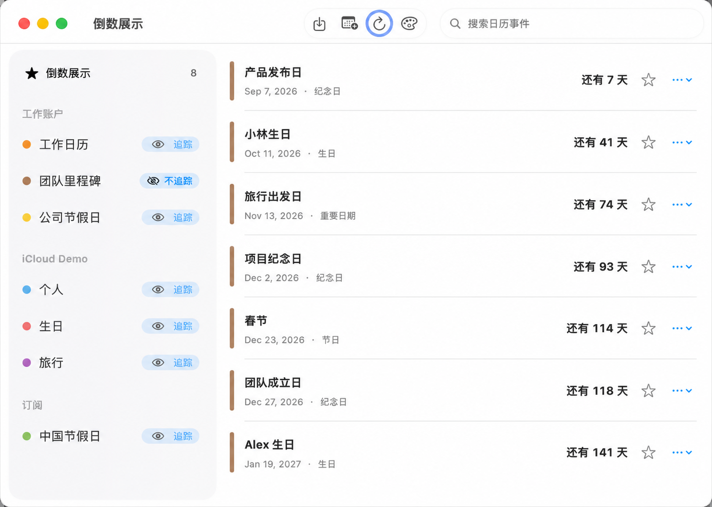
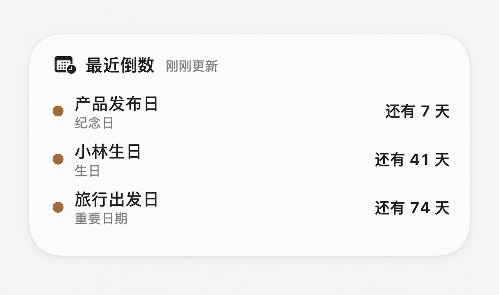
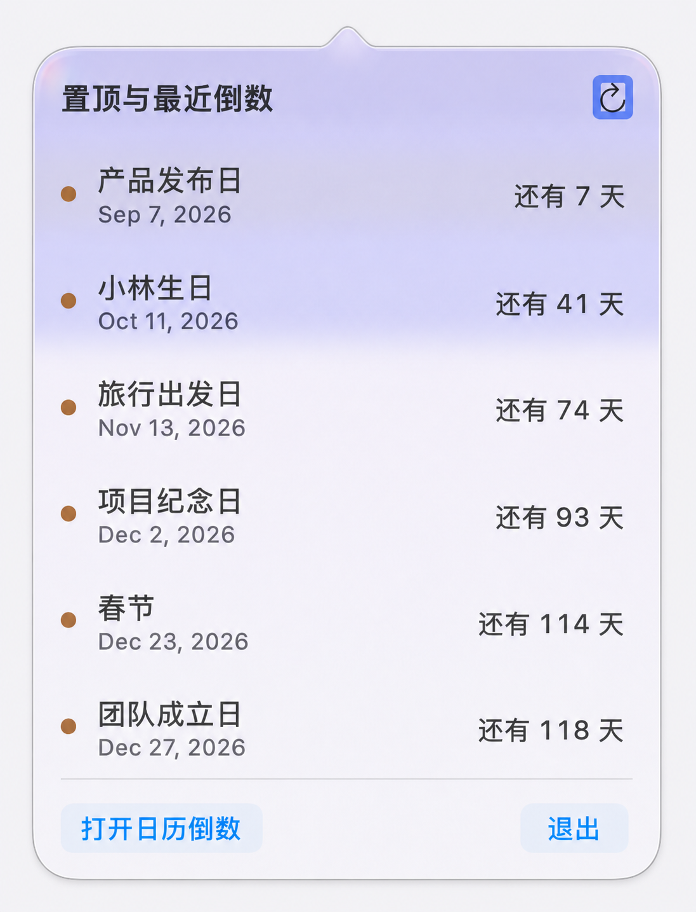

# CalendarCountdown · Contagem regressiva do calendário

> Um rastreador nativo de datas importantes para macOS. O Apple Calendar continua sendo a fonte da verdade, enquanto usuários, widgets e agentes de IA recebem uma camada de contagem regressiva clara e portável.

[中文](README.md) · [English](README.en.md) · [日本語](README.ja.md) · [한국어](README.ko.md) · [Español](README.es.md) · [Português](README.pt.md) · [Deutsch](README.de.md) · [Français](README.fr.md)

## Capturas de tela

<p align="center">
  
</p>

<p align="center">
  
</p>

<p align="center">
  
</p>

> Todos os calendários, nomes e datas nas imagens são dados fictícios de demonstração; nenhuma informação real de usuário está incluída.

## O que é

CalendarCountdown não é outro banco de dados de calendário. Contas, calendários, eventos e cores continuam sob o controle do Apple Calendar. O projeto lê e grava calendários autorizados pelo usuário por meio do EventKit e se concentra em manter datas importantes visíveis, calculáveis, exportáveis e fáceis de automatizar.

## Recursos principais

- Lê calendários Apple autorizados preservando contas, categorias e cores nativas.
- Acompanha aniversários, datas comemorativas, feriados e datas importantes sem repetição.
- Suporta regras anuais do calendário gregoriano e lunar chinês, incluindo mês intercalar e ajuste para meses curtos.
- Calcula “hoje”, “amanhã” e os dias restantes usando o calendário local do sistema.
- App nativo para macOS, visualização na barra de menus e widget de desktop com WidgetKit.
- Um anel azul persistente mantém a ação de atualizar fácil de localizar tanto na janela principal quanto no menu suspenso.
- Adiciona eventos comuns e aniversários gregorianos ou lunares a um calendário Apple escolhido explicitamente.
- Exporta com um clique todas as datas importantes acompanhadas no momento.
- Binário universal para Macs Apple Silicon e Intel, com macOS 14 ou posterior.

## Projetado para agentes de IA

`calcount` é uma CLI local que pode ser exposta diretamente como ferramenta shell de um agente. Todos os comandos estruturados emitem JSON sem texto interativo, e códigos de saída explícitos distinguem erros de uso, falta de autorização do calendário e falhas de execução.

Características voltadas a agentes:

- **Leituras previsíveis:** lista calendários, consulta eventos, obtém as próximas contagens e lê o índice de acompanhamento.
- **Envelopes JSON estáveis:** sucesso usa `{ "ok": true, "data": ... }`; falha usa `{ "ok": false, "error": { "code": ..., "message": ... } }`.
- **Gravações verificáveis:** toda gravação exige um calendário Apple explícito, e importações em lote aceitam `--dry-run`.
- **Importação idempotente:** `externalId` evita duplicações quando um agente repete uma solicitação.
- **Contexto portável:** `tracked-events.json` preserva ano inicial, sistema de calendário, mês, dia, recorrência, próxima ocorrência e referências do Apple Calendar.
- **Local em primeiro lugar:** não exige servidor nem réplica do calendário na nuvem; acessa apenas dados EventKit autorizados no Mac atual.

Comandos comuns de leitura e exportação:

```bash
./calcount doctor
./calcount calendars list
./calcount events list --days 365
./calcount next --limit 10 --days 3653
./calcount tracking refresh
./calcount tracking list
./calcount tracking export --output tracked-events.json
```

Um agente pode consumir o resultado diretamente com `jq`:

```bash
./calcount next --limit 5 | jq '.data[] | {title, eventDate, calendarTitle}'
```

Visualize uma importação antes de gravar:

```bash
./calcount import /path/to/import.json --dry-run
```

Atualmente, `calcount` fornece um contrato CLI local. Ele não afirma ser um servidor MCP ou uma API remota, mas pode ser envolvido por qualquer framework de agentes com suporte a ferramentas shell.

## JSON de datas acompanhadas

O Apple Calendar sempre permanece como a fonte da verdade do conteúdo dos eventos. `tracked-events.json` não é um segundo banco de dados; é um índice versionado e exportável dos itens visíveis na contagem regressiva.

Cada registro inclui:

- UUID estável, título e tipo: aniversário, data comemorativa, data importante ou outro.
- Ano inicial, mês, dia e marcador gregoriano/lunar.
- Frequência, calendário de recorrência e políticas para casos-limite lunares.
- Próxima ocorrência, horário, fuso horário e estado de dia inteiro.
- Origem, calendário, cor e identificadores do Apple Calendar para nova associação.
- Modo de acompanhamento, momento inicial e estado fixado.

Veja o exemplo anônimo completo em [tracked-events.example.json](Documentation/tracked-events.example.json).

## Instalação

Versão atual: **1.0.0**

1. [Baixe CalendarCountdown-1.0.0-macos-universal.dmg no GitHub Releases](https://github.com/MyKWK/CalendarCountdown/releases/download/v1.0.0/CalendarCountdown-1.0.0-macos-universal.dmg).
2. Arraste CalendarCountdown para Aplicativos.
3. Inicie o app e conceda acesso completo ao Apple Calendar.

A versão 1.0.0 usa atualmente assinatura ad-hoc; não possui assinatura Apple Developer ID nem notarização. Na primeira execução, talvez seja necessário clicar no app com a tecla Control no Finder e escolher Abrir.

## Compilar a partir do código-fonte

Requer macOS 14+, Xcode e [XcodeGen](https://github.com/yonaskolb/XcodeGen).

```bash
cd Source
./Scripts/bootstrap.sh
./Scripts/build.sh
xcodebuild -project CalendarCountdown.xcodeproj -scheme CalendarCountdown \
  -configuration Debug -destination 'platform=macOS,arch=arm64' \
  -derivedDataPath DerivedData CODE_SIGNING_ALLOWED=NO test
./Scripts/package-dmg.sh
```

## Limites de dados e privacidade

- Os eventos permanecem no Apple Calendar; o projeto não opera um serviço próprio de calendário em nuvem.
- As seleções e `tracked-events.json` permanecem no Mac para exibição e exportação iniciada pelo usuário.
- As gravações afetam apenas o calendário Apple escolhido explicitamente.
- Arquivos reais de datas pessoais são excluídos por `.gitignore` e não devem entrar no repositório público nem no pacote de lançamento.

## Escopo atual

- O macOS é suportado atualmente. App para iPhone, widgets do iPhone e sincronização de regras via CloudKit são trabalhos futuros.
- Este projeto não é um servidor CalDAV e não duplica a hierarquia de contas ou categorias do Apple Calendar.
- Consulte [Documentation/PRODUCT.md](Documentation/PRODUCT.md) para o contrato detalhado de produto e dados.

## Estrutura do repositório

- `Source/`: código Swift, configuração do XcodeGen, testes e scripts de compilação.
- `Documentation/`: contrato do produto, instruções de instalação e exemplos JSON anônimos.
- `Releases/1.0.0/`: notas da versão e checksum SHA-256; o DMG é distribuído pelo GitHub Releases.

## Licença

Este projeto é disponibilizado sob a [Licença MIT](LICENSE).
